## Soal 14

### Soal
> Setelah gagal mengakses FTP, Eiri melancarkan serangan brute-force terhadap form login web Alice. Analisis file capture wired_bruteforce.pcapng untuk mengidentifikasi alamat IP penyerang, target IP beserta port yang diserang, password user lain_admin yang berhasil ditembus, serta web server software dan versi yang dilaporkan pada response header. Validasi temuan kalian pada socket server: (link file) nc [IP_Group] 3401

### Bukti dan Hasil
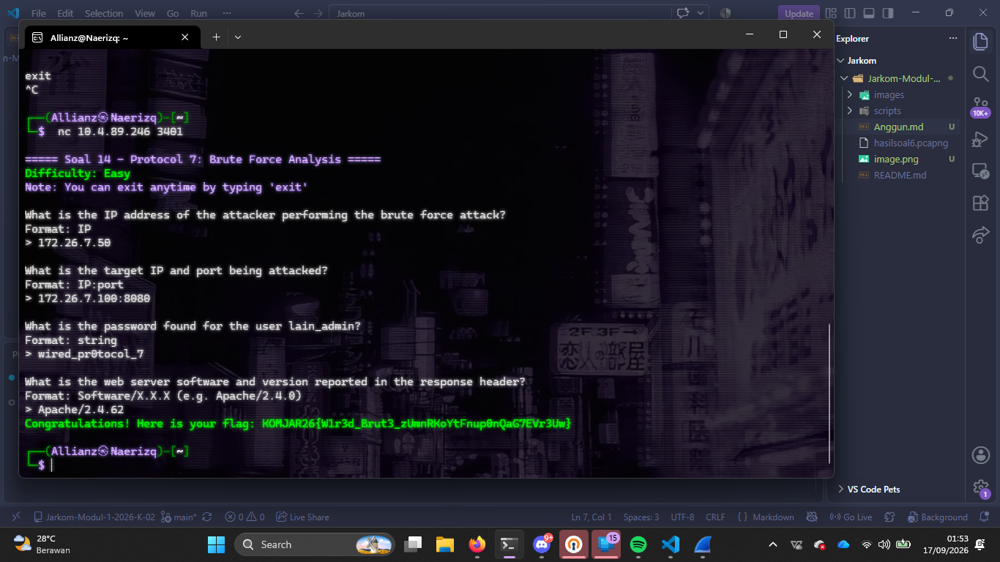
   - Bukti mendapat IP penyerang dan diserang
      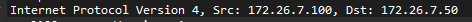
   - Bukti menemukan port, password dan server
      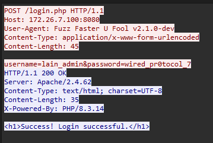
### Langkah Pengerjaan

1. **Membuka Wire the shark**:
   - Untuk melhat aktivitas yang dilakukan kita bisa mencapture melalui Wire the shark
2. **Import file yang telah disediakan ke Wire The Shark**
3. **Amati aktivitas yang ada dan cari yang ditanyakan**
    - Pastinya terdapat banyak sekali aktivitas, cara memilahnya adalah dengan menggunakan fitur find lalu cari HTTP. Maka akan terlihat aktivitasnya. Kita juga bisa klik kanan dan tekan follow lalu tekan HTTP form 

## Soal 15

### Soal
>Eiri menyusup ke ruang server dan memasang perangkat keyboard USB berbahaya pada node Alice. Buka file capture wired_usb_hid.pcap, identifikasi Vendor ID dan Product ID perangkat USB dari deskriptor USB, alamat nomor device USB, serta pesan rahasia yang berhasil dicuri dari keystroke. Validasi temuan kalian pada socket server:
(link file) nc [IP_Group] 3402 

### Bukti dan Hasil

   - Ubah kode menjadi string untuk tau pesan rahasia
   
   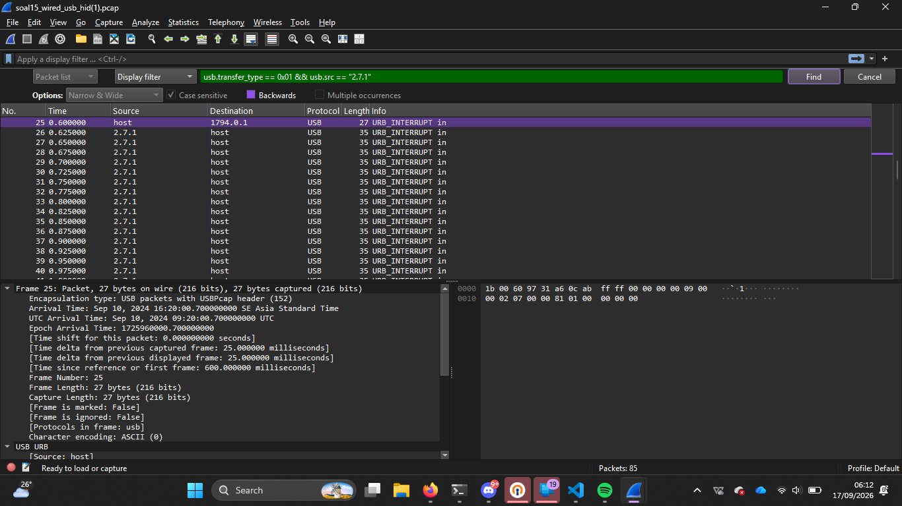
   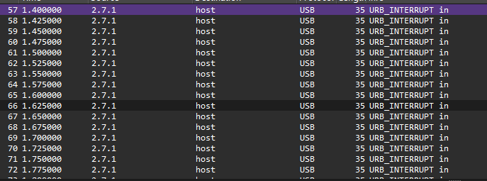
   

   - Disini melihat device addressnya, yang awalnya 0 berubah menjadi 7
   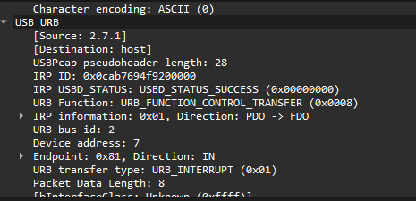

   - melihat id
   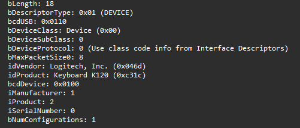

### Langkah Pengerjaan
1. **Import file**
2. **Cari berdasarkan yang diminta dalam terminal**
3. **Decode sebuah kode menjadi sebuah string**

## Soal 16

### Soal
> Eiri meletakkan file malware di server. Dari file capture wired_ftp_theft.pcap, lakukan analisis lalu lintas FTP untuk mengidentifikasi alamat IP server FTP penyerang, banner software FTP yang digunakan, kredensial login penyerang, serta ukuran (size in bytes) dari file malware knights_payload.exe yang diunduh. Validasi temuan kalian pada socket server:
	(link file) nc [IP_Group] 3403 

### Bukti dan Hasil
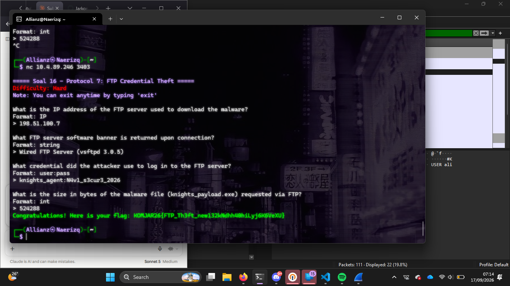

 - Menemukan IP yang mendownload malware dengan tipe data .exe
 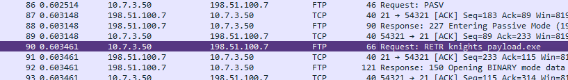
 - Menemukan FTP server software banner, user, password, 
 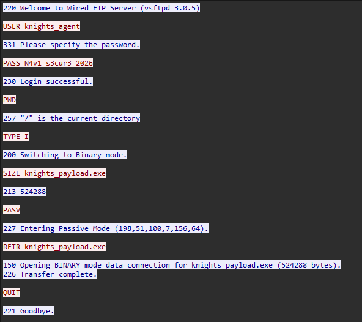
- Menemukan size file

### Langkah Pengerjaan
1. **Import file**
2. **Cari berdasarkan yang diminta dalam terminal**

## Soal 17

### Soal
> Alice membuat halaman web di node-nya. Eiri memanfaatkan celah untuk mengunduh payload berbahaya ke sistem Alice. Analisis file capture wired_http_c2.pcap untuk mengidentifikasi nama domain (Host) tempat malware diunduh, alamat IP server penyerang, nama file executable malware yang diunduh, serta kode status HTTP yang dikembalikan. Validasi temuan kalian pada socket server:
(link file) nc [IP_Group] 3404

### Bukti dan Hasil

   - Bukti Host, HTTP Status, File Name
   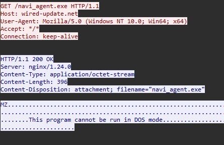
   - Bukti IP yang menghousting
   

### Langkah Pengerjaan
1. **Import file**
2. **Cari berdasarkan yang diminta dalam terminal**
3. **Ada packet yang harus di follow -> TCP Stream**

## Soal 18

### Soal
> Eiri mengubah taktik penyerangan dengan menanamkan file malware menggunakan protokol file sharing SMB. Analisis file capture wired_smb_transfer.pcapng untuk mengidentifikasi nama protokol jaringan yang dieksploitasi, IP pengirim dan penerima, folder tujuan penyimpanan malware pada sistem korban, serta nama file executable malware yang ditransfer. Validasi temuan kalian pada socket server:
(link file) nc [IP_Group] 3405

### Bukti dan Hasil
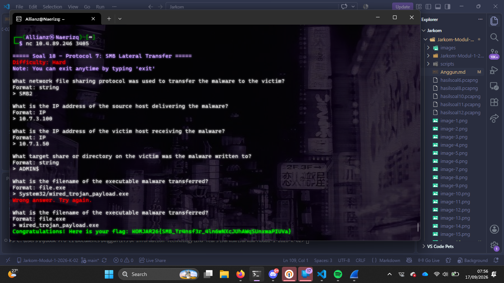

 - Protocol Type to download malware
 
 - Host delevering address & Host receiving address
 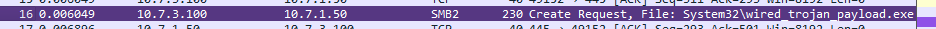
- Menemukan directory

   
- Menemukan file name 
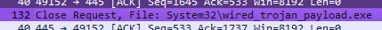

### Langkah Pengerjaan
1. **Import file**
2. **Cari berdasarkan yang diminta dalam terminal**
3. **Ada packet yang harus di follow -> TCP Stream**
