# Laporan Resmi Praktikum Modul 1
### Komunikasi Data & Jaringan Komputer 2026

**Kelompok:** K-02  
**Prefix IP Kelompok:** `192.212.x.x`  
**Tema:** *Serial Experiments Lain*  

>Naila Anggun Eka Rizqy | 5027251122

>Maulana Zaki Putra Zakaria | 5027251009

---

## Soal 1

>Dikerjakan Oleh Zaki

### Soal
> Untuk mempersiapkan pembangunan The Wired, Lain yang berperan sebagai Router membuat tiga Switch/Gateway: Switch 1 menuju dua Entitas yaitu Alice dan Mika, Switch 2 menuju Chisa, sedangkan Switch 3 menuju Knights dan Eiri. Kelima Entitas tersebut dikonfigurasi sebagai Client di GNS3. [GUNAKAN PREFIX IP MASING-MASING KELOMPOK]

### Langkah Pengerjaan

1. **Menambahkan Node pada GNS3**:
   - 1 node Debian (`debinet-1`) sebagai **Router Lain** (diatur memiliki 4 interface network adapter).
   - 3 node **Ethernet Switch** (`Switch1`, `Switch2`, `Switch3`).
   - 5 node Alpine (`alpinet`) sebagai Client: **Alice**, **Mika**, **Chisa**, **Knights**, dan **Eiri**.

2. **Pengkabelan (Wiring)**:
   - **Router Lain**:
     - `eth0` $\rightarrow$ NAT1
     - `eth1` $\rightarrow$ Switch1
     - `eth2` $\rightarrow$ Switch2
     - `eth3` $\rightarrow$ Switch3
   - **Switch1** $\rightarrow$ Alice (`eth0`), Mika (`eth0`)
   - **Switch2** $\rightarrow$ Chisa (`eth0`)
   - **Switch3** $\rightarrow$ Knights (`eth0`), Eiri (`eth0`)

3. **Konfigurasi Interface (`/etc/network/interfaces`)**:

   - **Router Lain**:
     ```bash
     auto eth0
     iface eth0 inet dhcp

     auto eth1
     iface eth1 inet static
         address 192.212.1.1
         netmask 255.255.255.0

     auto eth2
     iface eth2 inet static
         address 192.212.2.1
         netmask 255.255.255.0

     auto eth3
     iface eth3 inet static
         address 192.212.3.1
         netmask 255.255.255.0
     ```

   - **Alice (`alpinet-1`)**:
     ```bash
     auto eth0
     iface eth0 inet static
         address 192.212.1.2
         netmask 255.255.255.0
         gateway 192.212.1.1
     ```

   - **Mika (`alpinet-2`)**:
     ```bash
     auto eth0
     iface eth0 inet static
         address 192.212.1.3
         netmask 255.255.255.0
         gateway 192.212.1.1
     ```

   - **Chisa (`alpinet-3`)**:
     ```bash
     auto eth0
     iface eth0 inet static
         address 192.212.2.2
         netmask 255.255.255.0
         gateway 192.212.2.1
     ```

   - **Knights (`alpinet-4`)**:
     ```bash
     auto eth0
     iface eth0 inet static
         address 192.212.3.2
         netmask 255.255.255.0
         gateway 192.212.3.1
     ```

   - **Eiri (`alpinet-5`)**:
     ```bash
     auto eth0
     iface eth0 inet static
         address 192.212.3.3
         netmask 255.255.255.0
         gateway 192.212.3.1
     ```

4. **Menjalankan dan Menerapkan Konfigurasi**:
   - Simpan konfigurasi pada setiap node.
   - Jalankan perintah `ifup -a` (atau restart node) di GNS3 agar seluruh konfigurasi antarmuka diterapkan.

### Bukti dan Hasil

1. **Topologi Jaringan di GNS3**:
   

2. **Verifikasi Alamat IP Router Lain (`ip -br a`)**:
   

3. **Uji Ping ke Gateway Masing-Masing Subnet**:
   - **Alice $\rightarrow$ Gateway Subnet 1 (`192.212.1.1`)**:
     

   - **Chisa $\rightarrow$ Gateway Subnet 2 (`192.212.2.1`)**:
     

   - **Eiri $\rightarrow$ Gateway Subnet 3 (`192.212.3.1`)**:
     

---

## Soal 2

>Dikerjakan Oleh Zaki

### Soal
> Karena menurut Lain pada saat itu The Wired masih terisolasi dari dunia luar, konfigurasikan router Lain agar dapat tersambung langsung ke jaringan internet publik melalui NAT/DHCP pada interface eth0.

### Langkah Pengerjaan

1. **Konfigurasi DHCP pada Interface `eth0` Router Lain**:
   Menghubungkan interface `eth0` Router Lain ke interface `nat0` pada node `NAT1`, kemudian mengatur `eth0` menggunakan mode DHCP pada file `/etc/network/interfaces`:
   ```bash
   auto eth0
   iface eth0 inet dhcp
   ```

2. **Konfigurasi DNS Resolver**:
   Menambahkan nameserver pada `/etc/resolv.conf` di Router Lain agar dapat melakukan translasi nama domain ke IP internet:
   ```bash
   nameserver 8.8.8.8
   nameserver 1.1.1.1
   ```

3. **Pengujian Konektivitas**:
   Melakukan verifikasi koneksi dari konsol Router Lain dengan mengirimkan ping ke IP publik Google (`8.8.8.8`) dan ke nama domain (`google.com`).

### Bukti dan Hasil

1. **Uji Koneksi Internet Publik (IP & Domain)**:
   
   *Hasil pengujian menunjukkan bahwa Router Lain berhasil tersambung ke jaringan internet publik melalui interface eth0 (DHCP NAT) dengan bukti balasan ping ke `8.8.8.8` dan `google.com` bernilai 0% packet loss.*

---

## Soal 3

>Dikerjakan Oleh Zaki

### Soal
> Setelah router Lain terhubung ke internet, pastikan seluruh Entitas (Client) di bawah Switch 1, Switch 2, dan Switch 3 dapat saling terhubung dan berkomunikasi satu sama lain melalui konfigurasi routing.

### Langkah Pengerjaan

1. **Mengaktifkan IP Forwarding pada Router Lain**:
   Agar router dapat meneruskan paket antar-interface (antar-subnet yang terhubung langsung ke `eth1`, `eth2`, dan `eth3`), fitur perutean paket pada kernel Linux diaktifkan melalui perintah:
   ```bash
   sysctl -w net.ipv4.ip_forward=1
   ```
   Verifikasi nilai kernel IP forwarding aktif (bernilai `1`):
   ```bash
   cat /proc/sys/net/ipv4/ip_forward
   ```

2. **Pengujian Routing Antar-Entitas (Inter-Subnet)**:
   Melakukan uji konektivitas antar-client yang berada di switch berbeda:
   - Dari **Alice** (`192.212.1.2` di Switch 1) menuju **Chisa** (`192.212.2.2` di Switch 2).
   - Dari **Alice** (`192.212.1.2` di Switch 1) menuju **Knights** (`192.212.3.2` di Switch 3).

### Bukti dan Hasil

1. **Verifikasi IP Forwarding Aktif di Router Lain**:
   
   *Pengecekan `/proc/sys/net/ipv4/ip_forward` menghasilkan nilai `1` yang menandakan Router Lain siap meneruskan lalu lintas antar-subnet.*

2. **Uji Ping Alice ke Chisa (Switch 1 $\rightarrow$ Switch 2)**:
   
   *Ping dari Alice ke Chisa (`192.212.2.2`) berhasil dengan 0% packet loss dan TTL bernilai 63 (berkurang 1 hop saat melintasi Router Lain).*

3. **Uji Ping Alice ke Knights (Switch 1 $\rightarrow$ Switch 3)**:
   
   *Ping dari Alice ke Knights (`192.212.3.2`) berhasil dengan 0% packet loss dan TTL bernilai 63.*

---

## Soal 4

>Dikerjakan Oleh Zaki

### Soal
> Lain ingin agar setiap Entitas (Client) memiliki kemandirian di The Wired. Konfigurasikan firewall/iptables (NAT Masquerade) dan DNS resolver agar setiap Client dapat terhubung ke internet secara mandiri (dapat melakukan ping ke 8.8.8.8 dan membuka domain web google.com).

### Langkah Pengerjaan

1. **Konfigurasi NAT Masquerade pada Router Lain**:
   Menerapkan aturan iptables pada chain `POSTROUTING` dengan interface keluar `eth0` agar seluruh paket dari segmen LAN (`192.212.x.x`) disamarkan alamat sumbernya menjadi IP milik `eth0` Router saat menuju jaringan luar:
   ```bash
   iptables -t nat -A POSTROUTING -o eth0 -j MASQUERADE
   ```
   Memeriksa tabel NAT untuk memastikan rule aktif:
   ```bash
   iptables -t nat -L -v -n
   ```

2. **Konfigurasi DNS Resolver pada Client**:
   Menambahkan nameserver publik (`8.8.8.8` dan `1.1.1.1`) ke file `/etc/resolv.conf` pada seluruh entitas client agar dapat mengenali nama domain internet:
   ```bash
   nameserver 8.8.8.8
   nameserver 1.1.1.1
   ```

3. **Pengujian Konektivitas Internet dari Client**:
   Melakukan uji coba konektivitas dari konsol client (Eiri) dengan mengirimkan ping ke IP publik (`8.8.8.8`) dan domain web (`google.com`).

### Bukti dan Hasil

1. **Verifikasi Tabel NAT di Router Lain**:
   
   *Tabel NAT chain POSTROUTING menunjukkan rule target MASQUERADE aktif pada interface eth0 untuk semua traffic (0.0.0.0/0).*

2. **Uji Koneksi Internet dari Client (Eiri)**:
   
   *Client Eiri (`192.212.3.3`) berhasil melakukan ping ke `8.8.8.8` dan domain web `google.com` dengan 0% packet loss, membuktikan bahwa client memiliki akses internet mandiri via NAT Masquerade dan DNS resolver.*

---

## Soal 5

>Dikerjakan Oleh Zaki

### Soal
> Eiri tetap berupaya menanamkan kekacauan ke dalam jaringan. Untuk mengantisipasi restart tiba-tiba, pastikan seluruh konfigurasi jaringan tidak hilang saat semua node di-restart. Buat script verifikasi di `/root/cek_status.sh` pada router Lain yang menampilkan ringkasan interface (`ip -br a`) dan status tabel NAT (`iptables -t nat -L -v -n`) setelah reboot.

### Langkah Pengerjaan

1. **Menjaga Persistensi Konfigurasi Jaringan**:
   Seluruh konfigurasi interface, kernel IP forwarding, iptables NAT Masquerade, dan DNS didaftarkan ke dalam file `/etc/network/interfaces` serta dibuatkan script otomatisasi `/root/init.sh` yang dipanggil melalui `/root/.bashrc` agar dieksekusi secara otomatis setiap kali sistem menyala.

2. **Pembuatan Script Verifikasi `/root/cek_status.sh`**:
   Membuat script pada direktori root (`/root/cek_status.sh`) di Router Lain yang menampilkan ringkasan IP antarmuka dan tabel NAT:
   ```bash
   cat << 'EOF' > /root/cek_status.sh
   #!/bin/bash
   echo "RINGKASAN INTERFACE"
   ip -br a
   echo ""
   echo "STATUS TABEL NAT (IPTABLES)"
   iptables -t nat -L -v -n
   EOF
   chmod +x /root/cek_status.sh
   ```

3. **Verifikasi Pasca-Reboot**:
   Melakukan restart pada node Router Lain (Stop $\rightarrow$ Start di GNS3), kemudian mengeksekusi `/root/cek_status.sh` untuk membuktikan bahwa konfigurasi tetap bertahan dan tidak hilang.

### Bukti dan Hasil

1. **Pembuatan Script `/root/cek_status.sh`**:
   
   *Isi file script `/root/cek_status.sh` pada Router Lain.*

2. **Eksekusi Script Pasca-Reboot**:
   
   *Hasil eksekusi `/root/cek_status.sh` setelah reboot membuktikan bahwa seluruh interface (`eth0`, `eth1`, `eth2`, `eth3`) tetap UP dengan pengalamatan IP yang sesuai, serta tabel NAT Masquerade tetap bertahan dan aktif mencatat paket lalu lintas jaringan.*

---

## Soal 6

>Dikerjakan Oleh Zaki

### Soal
> Mika mencurigai adanya anomali traffic pada segmen jaringannya. Jalankan generator traffic berikut pada node Mika, lalu lakukan packet sniffing menggunakan Wireshark pada interface node Mika. Terapkan display filter khusus untuk menyaring paket yang berprotokol DNS atau ICMP. Tunjukkan screenshot hasil filter beserta ringkasan paket yang lolos.

### Langkah Pengerjaan

1. **Menjalankan Script Generator Traffic**:
   Menjalankan script `/root/traffic_protocol7.sh` pada node Mika untuk menghasilkan anomali lalu lintas data berupa paket ICMP (ping ke berbagai IP) dan query DNS (nslookup & dig ke berbagai domain).

2. **Packet Sniffing dengan Wireshark**:
   Melakukan penyadapan paket (*packet sniffing*) secara live pada link antarmuka antara `Switch1` dan `Mika` (`eth0`) menggunakan Wireshark.

3. **Penerapan Display Filter**:
   Menerapkan display filter khusus untuk memilah paket yang hanya berprotokol DNS atau ICMP:
   ```text
   dns || icmp
   ```

### Bukti dan Hasil

1. **Eksekusi Generator Traffic di Mika**:
   
   *Proses eksekusi `/root/traffic_protocol7.sh` pada node Mika berhasil membangkitkan lalu lintas jaringan DNS dan ICMP.*

2. **Hasil Display Filter Wireshark & Ringkasan Paket**:
   
   *Penerapan display filter `dns || icmp` (berwarna hijau) berhasil menyaring seluruh paket terkait. Berdasarkan status bar Wireshark, dari total 66 paket yang tertangkap, terdapat **58 paket (84.8%)** yang lolos filter berprotokol DNS dan ICMP.*

---

## Soal 7

>Dikerjakan Oleh Zaki

### Soal
> Chisa memutuskan mendirikan FTP Server pada node miliknya dengan shared folder di `/var/wired/data`. Terapkan kebijakan akses: user `alice` (hak akses read & write), user `mika` (dibatasi read-only), dan user `eiri` (dibatasi tanpa izin akses / blacklist). Buktikan konfigurasi dengan membuat file `signal_alice.txt` dari user alice, dan buktikan penolakan akses saat user eiri mencoba login.

### Langkah Pengerjaan

1. **Instalasi dan Konfigurasi FTP Server pada Node Chisa**:
   - Memasang daemon FTP ringan dan aman `vsftpd` pada node Chisa (`192.212.2.2`).
   - Membuat shared folder `/var/wired/data` dengan perizinan penuh (`chmod -R 777 /var/wired/data`).
   - Mendaftarkan akun Linux `alice`, `mika`, dan `eiri` dengan direktori basis `/var/wired/data`.
   - Mengatur kebijakan hak akses:
     - User **Alice** diberikan izin baca dan tulis (`write_enable=YES`) melalui direktori konfigurasi per-user `/etc/vsftpd/user_conf/alice`.
     - User **Mika** dibatasi hanya dapat membaca atau mengunduh saja (`write_enable=NO`) melalui `/etc/vsftpd/user_conf/mika`.
     - User **Eiri** dimasukkan ke dalam daftar hitam `/etc/vsftpd/user_list` dengan mengaktifkan `userlist_deny=YES` sehingga langsung ditolak oleh server saat mencoba login.
   - Mengaktifkan `seccomp_sandbox=NO` agar vsFTPd berjalan stabil di lingkungan container Alpine, serta mengonfigurasi rentang port pasif (`pasv_min_port=30000`, `pasv_max_port=30005`).
   - Skrip konfigurasi otomasi disimpan pada `/root/setup_ftp_chisa.sh`:
     ```bash
     apk update && apk add --no-cache vsftpd
     mkdir -p /var/wired/data /etc/vsftpd/user_conf

     adduser -D -h /var/wired/data -s /bin/sh alice 2>/dev/null || true
     echo "alice:wired123" | chpasswd

     adduser -D -h /var/wired/data -s /bin/sh mika 2>/dev/null || true
     echo "mika:wired123" | chpasswd

     adduser -D -h /var/wired/data -s /bin/sh eiri 2>/dev/null || true
     echo "eiri:wired123" | chpasswd

     chmod -R 777 /var/wired/data

     cat << 'USER_EOF' > /etc/vsftpd/user_conf/alice
     write_enable=YES
     local_root=/var/wired/data
     USER_EOF

     cat << 'USER_EOF' > /etc/vsftpd/user_conf/mika
     write_enable=NO
     local_root=/var/wired/data
     USER_EOF

     echo "eiri" > /etc/vsftpd/user_list

     cat << 'CONF_EOF' > /etc/vsftpd/vsftpd.conf
     listen=YES
     listen_ipv6=NO
     anonymous_enable=NO
     local_enable=YES
     write_enable=YES
     local_umask=022
     dirmessage_enable=YES
     use_localtime=YES
     xferlog_enable=YES
     connect_from_port_20=YES
     local_root=/var/wired/data
     chroot_local_user=YES
     allow_writeable_chroot=YES
     seccomp_sandbox=NO
     user_config_dir=/etc/vsftpd/user_conf
     userlist_enable=YES
     userlist_file=/etc/vsftpd/user_list
     userlist_deny=YES
     pasv_enable=YES
     pasv_min_port=30000
     pasv_max_port=30005
     CONF_EOF

     killall vsftpd 2>/dev/null || true
     /usr/sbin/vsftpd /etc/vsftpd/vsftpd.conf &
     ```

2. **Pengujian Hak Akses Read & Write oleh User Alice**:
   - Menyiapkan berkas `/root/signal_alice.txt` pada node Alice.
   - Melakukan koneksi FTP ke server Chisa (`192.212.2.2`) dan mengunggah berkas menggunakan script `/root/test_ftp_alice.sh`:
     ```bash
     apk update && apk add --no-cache lftp

     echo "Signal from Alice to The Wired - Connection Verified." > /root/signal_alice.txt

     lftp -u alice,wired123 192.212.2.2 << 'FTP_EOF'
     set ftp:ssl-allow no
     put /root/signal_alice.txt
     ls
     bye
     FTP_EOF
     ```

3. **Pengujian Pembatasan Akses (Blacklist) pada User Eiri**:
   - Mencoba melakukan koneksi dan autentikasi sebagai user `eiri` menuju FTP server Chisa dari node Eiri dengan script `/root/test_ftp_eiri.sh`:
     ```bash
     apk update && apk add --no-cache lftp

     lftp -u eiri,wired123 192.212.2.2 << 'FTP_EOF'
     set ftp:ssl-allow no
     ls
     bye
     FTP_EOF
     ```

### Bukti dan Hasil

1. **Status Layanan vsFTPd pada Node Chisa**:
   
   *Proses `vsftpd` berjalan normal pada latar belakang dan membuka listening socket pada port 21.*

2. **Bukti Upload Berkas `signal_alice.txt` oleh Alice**:
   
   *User Alice berhasil melakukan autentikasi dan mengunggah berkas `signal_alice.txt` ke shared folder server Chisa, terbukti dari keluaran `ls` yang menampilkan berkas tersebut.*

3. **Verifikasi Keberadaan Berkas di Node Chisa**:
   
   *Pemeriksaan lokal pada node Chisa melalui `ls -la /var/wired/data` dan `cat` membuktikan bahwa `signal_alice.txt` tersimpan dengan benar di dalam shared folder.*

4. **Bukti Penolakan Akses (Blacklist) pada User Eiri**:
   
   *Saat user Eiri mencoba melakukan login ke server FTP Chisa, server langsung merespons dengan `530 Permission denied`, membuktikan bahwa mekanisme blacklist berhasil menolak akses login.*

---

## Soal 8

>Dikerjakan Oleh Zaki

### Soal
> Kelompok rahasia Knights perlu mengirimkan dokumen laporan intelijen ke FTP Server Chisa. Lakukan koneksi FTP client dari node Knights ke FTP Server Chisa menggunakan akun alice. Upload file berikut (`knights_report.txt`). Analisis sesi Wireshark dan sebutkan: perintah FTP untuk upload (STOR), kode status sukses server (226), dan port data TCP yang dinegosiasikan pada mode PASV.

### Langkah Pengerjaan

1. **Persiapan Berkas Laporan Intelijen pada Node Knights**:
   Menyiapkan berkas `/root/knights_report.txt` pada node Knights yang memuat laporan pemantauan The Wired (*LEVEL 7 — EYES ONLY*).

2. **Packet Sniffing dengan Wireshark**:
   Mengaktifkan penangkapan paket (*live capture*) pada antarmuka link antara `Knights` (`eth0`) dan `Switch3` melalui menu **Start capture** di GNS3.

3. **Eksekusi Pengunggahan Berkas dari Node Knights**:
   Melakukan transfer berkas menuju server FTP Chisa (`192.212.2.2`) dengan kredensial akun `alice` dalam mode pasif (`PASV`) menggunakan script `/root/upload_knights.sh`:
   ```bash
   apk update && apk add --no-cache lftp

   cat << 'FILE_EOF' > /root/knights_report.txt
   ==================================================
     KNIGHTS OF THE EASTERN CALCULUS — STATUS REPORT
     Protocol 7 Surveillance Network
     Classification: LEVEL 7 — EYES ONLY
   ==================================================

   Date: [CLASSIFIED]
   Agent: Knights Unit Alpha
   Node: Switch 3 — Subnet 10.<PREFIX>.3.0/24

   ---

   SUBJECT: Network Reconnaissance Report

   The Wired has been successfully infiltrated through
   Protocol 7 channels. Current observations:

   1. Router "Lain" has been identified as the central
      gateway node connecting all three subnet segments.

   2. Switch 1 (10.<PREFIX>.1.0/24) hosts Alice and Mika.
      Both nodes show standard traffic patterns.

   3. Switch 2 (10.<PREFIX>.2.0/24) hosts Chisa alone.
      Isolated subnet — minimal cross-traffic observed.

   4. Switch 3 (10.<PREFIX>.3.0/24) — our operational base.
      Knights and Eiri coexist on this segment.

   RECOMMENDATION:
   Continue monitoring FTP and Telnet sessions for
   plaintext credential exposure. SSH tunnels remain
   impenetrable without keylog access.

   --- END OF REPORT ---
   Knights of the Eastern Calculus
   "Let's all love Lain."
   FILE_EOF

   lftp -u alice,wired123 192.212.2.2 << 'FTP_EOF'
   set ftp:ssl-allow no
   set ftp:passive-mode true
   set net:max-retries 1
   put /root/knights_report.txt
   ls
   bye
   FTP_EOF
   ```

4. **Analisis Protokol pada Wireshark**:
   Menerapkan display filter `ftp || ftp-data` untuk mengamati perintah kontrol dan saluran data yang terbentuk.

### Bukti dan Hasil

1. **Eksekusi Pengunggahan di Node Knights**:
   
   *Proses eksekusi `/root/upload_knights.sh` pada node Knights berhasil mengunggah berkas `knights_report.txt` (1111 bytes) ke FTP Server Chisa.*

2. **Aliran Sesi Komunikasi FTP pada Wireshark (`ftp || ftp-data`)**:
   
   *Seluruh siklus transmisi terekam dengan jelas, mulai dari autentikasi akun `alice`, negosiasi mode pasif (`PASV`), pengiriman berkas melalui data channel, hingga pemutusan koneksi (`QUIT`).*

3. **Analisis Komponen Sesuai Permintaan Soal**:

   * **Perintah FTP untuk Upload (`STOR`)**:
     
     *Tercatat pada paket **No. 5486**, client Knights mengirimkan perintah:*
     $$\text{Request: STOR knights\_report.txt}$$
     *Perintah ini menginstruksikan server untuk menyimpan aliran data yang dikirimkan ke dalam berkas `knights_report.txt`.*

   * **Kode Status Sukses Server (`226`)**:
     
     *Tercatat pada paket **No. 5493**, server Chisa merespons dengan kode status:*
     $$\text{Response: 226 Transfer complete.}$$
     *Menandakan bahwa transfer muatan berkas sebesar 1111 bytes melalui saluran data telah berhasil diterima dan ditutup secara sempurna oleh server.*

   * **Port Data TCP yang Dinegosiasikan pada Mode PASV**:
     
     *Tercatat pada paket **No. 5501** (dan No. 5481), client Knights mengirimkan instruksi `Request: PASV` untuk meminta server membuka data channel dalam mode pasif.*

     
     *Server Chisa membalas permintaan tersebut dengan respons kode status 227 (Paket No. 5502):*
     $$\text{Response: 227 Entering Passive Mode (192,212,2,2,117,48)}$$
     *Alamat IP data server adalah `192.212.2.2` dan nomor port TCP data pasif dihitung dari dua oktet terakhir:*
     $$\text{Port TCP Data} = (117 \times 256) + 48 = 29952 + 48 = \mathbf{30000}$$
     *(Pada sesi pengunggahan berkas di paket No. 5482 sebelumnya, negosiasi menghasilkan `(192,212,2,2,117,52)` dengan port TCP $(117 \times 256) + 52 = \mathbf{30004}$. Kedua port ini berada tepat di dalam rentang port pasif yang telah dikonfigurasikan pada vsFTPd Chisa yaitu `30000-30005`).*

---

## Soal 9

>Dikerjakan Oleh Zaki

### Soal
> Mika mengakses dokumen Protokol Tujuh di (link file) dari FTP Server Chisa. Dari node Mika, unduh file tersebut menggunakan akun mika. Setelah itu, buktikan pembatasan read-only dengan mencoba mengunggah file baru dari akun mika, dan tunjukkan pesan error respon server (error 550 Permission denied) saat mika mencoba melakukan upload.

### Langkah Pengerjaan

1. **Penyiapan Dokumen Protokol Tujuh di Server Chisa**:
   Menyimpan dokumen `protocol7_manifesto.txt` ke dalam shared folder `/var/wired/data/` pada node Chisa melalui script `/root/prepare_protocol7_chisa.sh`:
   ```bash
   cat << 'FILE_EOF' > /var/wired/data/protocol7_manifesto.txt
   ==================================================
     PROTOCOL 7 — THE MANIFESTO
     A Declaration of Digital Consciousness
     Serial Experiments Lain — Year 2026
   ==================================================

   ARTICLE I: THE NATURE OF THE WIRED
   -----------------------------------
   The Wired is not merely a network of interconnected
   machines. It is the collective unconscious of
   humanity, rendered in packets and protocols.

   Every TCP handshake is a conversation.
   Every DNS query is a question.
   Every encrypted tunnel is a whispered secret.

   ARTICLE II: THE SEVEN PRINCIPLES
   ----------------------------------
   1. All nodes are equal in the eyes of the router.
   2. No packet shall be dropped without cause.
   3. Encryption is the right of every connection.
   4. Plaintext protocols expose the vulnerable.
   5. The firewall protects, but also imprisons.
   6. NAT masquerade hides truth behind a single face.
   7. The Wired remembers everything — packet loss
      is merely a temporary forgetting.

   ARTICLE III: THE PROPHECY OF LAIN
   -----------------------------------
   "If you're not remembered, then you never existed."

   In the world of networking, persistence is survival.
   A configuration that vanishes upon restart is a
   thought that was never truly committed to memory.

   Therefore: Save your iptables. Write your interfaces.
   Let your routing tables endure beyond the power cycle.

   ARTICLE IV: CONCERNING SECURITY
   ---------------------------------
   Telnet is the glass house of protocols — transparent
   to any observer with a packet sniffer.

   SSH is the steel vault — its contents visible only
   to those who possess the key.

   Choose wisely which door you open to The Wired.

   ---
   "No matter where you go, everyone's connected."
   — Lain Iwakura
   FILE_EOF

   chmod 777 /var/wired/data/protocol7_manifesto.txt
   ```

2. **Pengujian Akses Read-Only oleh Node Mika**:
   Melakukan login sebagai user `mika` ke server FTP Chisa (`192.212.2.2`), mengunduh berkas `protocol7_manifesto.txt`, lalu mencoba mengunggah berkas baru `/root/mika_test_upload.txt` menggunakan script `/root/test_ftp_mika.sh`:
   ```bash
   apk update && apk add --no-cache lftp

   echo "This is a test upload from Mika to test read-only policy." > /root/mika_test_upload.txt

   lftp -u mika,wired123 192.212.2.2 << 'FTP_EOF'
   set ftp:ssl-allow no
   set net:max-retries 1
   get protocol7_manifesto.txt
   put /root/mika_test_upload.txt
   bye
   FTP_EOF

   cat /root/protocol7_manifesto.txt
   ```

### Bukti dan Hasil

1. **Pengunduhan Berkas dan Bukti Pembatasan Read-Only di Node Mika**:
   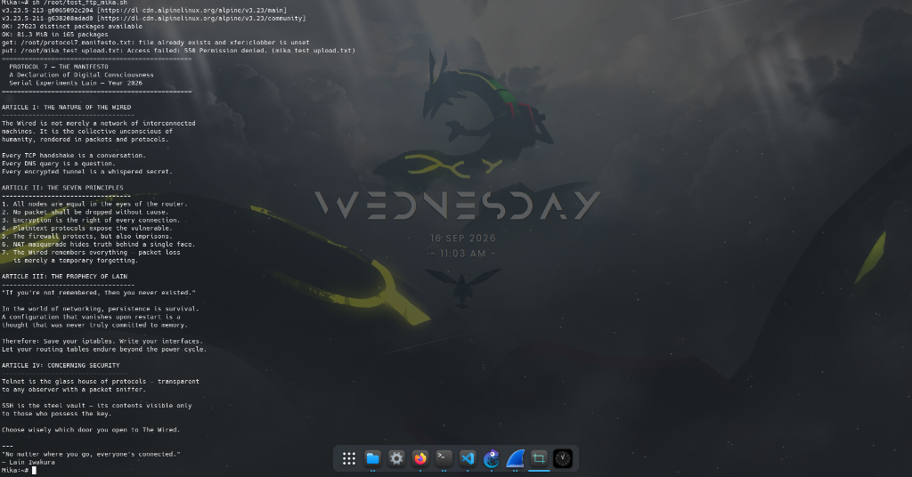
   *Berdasarkan eksekusi script pada terminal node Mika:*
   - **Hak Akses Baca (Read)**: Berkas `protocol7_manifesto.txt` berhasil diunduh ke direktori lokal node Mika, dan perintah `cat` sukses menampilkan seluruh isi manifesto *Protocol 7* secara utuh.
   - **Pembatasan Unggah (Write Disabled)**: Saat mencoba mengunggah berkas `mika_test_upload.txt`, server vsFTPd Chisa menolak perintah tersebut dengan mengembalikan pesan error:
     $$\text{put: /root/mika\_test\_upload.txt: Access failed: 550 Permission denied.}$$
     *Hal ini membuktikan bahwa konfigurasi direktori per-user `/etc/vsftpd/user_conf/mika` dengan opsi `write_enable=NO` berhasil membatasi hak akses user Mika menjadi strictly read-only.*

---

## Soal 10

>Dikerjakan Oleh Zaki

### Soal
> Knights melancarkan uji ketahanan koneksi ke server Chisa untuk menguji latensi jaringan The Wired. Kirimkan paket ping dari node Knights ke node Chisa dengan payload khusus 128 bytes dan interval 0.3 detik sebanyak 77 paket (`ping -c 77 -s 128 -i 0.3 <IP_Chisa>`). Buka Wireshark, catat nilai ICMP Type dan Code untuk Echo Request vs Echo Reply, serta analisis packet loss dan RTT (min/avg/max).

### Langkah Pengerjaan

1. **Packet Sniffing dengan Wireshark**:
   Mengaktifkan penangkapan paket (*live capture*) pada antarmuka link antara `Knights` (`eth0`) dan `Switch3` di GNS3, kemudian menerapkan display filter:
   ```text
   icmp
   ```

2. **Eksekusi Uji Ketahanan Ping pada Node Knights**:
   Mengirimkan 77 paket ICMP Echo Request menuju server Chisa (`192.212.2.2`) dengan spesifikasi ukuran payload 128 bytes dan interval 0.3 detik menggunakan script `/root/ping_test_knights.sh`:
   ```bash
   ping -c 77 -s 128 -i 0.3 192.212.2.2
   ```

### Bukti dan Hasil

1. **Hasil Eksekusi Ping dan Analisis Statistik Latensi (RTT)**:
   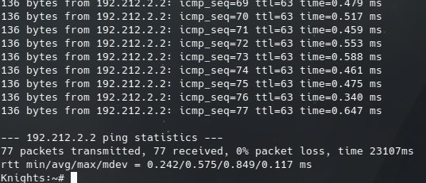
   *Hasil ringkasan pengujian pada terminal node Knights menunjukkan:*
   - **Total Paket Terkirim**: 77 paket
   - **Total Paket Diterima**: 77 paket
   - **Packet Loss**: **0% packet loss** (seluruh 77 paket berhasil diterima tanpa adanya data yang hilang)
   - **Total Waktu Transmisi**: 23107 ms (~23.1 detik)
   - **Analisis Nilai Round-Trip Time (RTT)**:
     - **RTT Minimum (`min`)**: **0.242 ms**
     - **RTT Rata-rata (`avg`)**: **0.575 ms**
     - **RTT Maksimum (`max`)**: **0.849 ms**
     - **Standar Deviasi / Jitter (`mdev`)**: **0.117 ms**
   *Latensi rata-rata berada di bawah 1 ms dengan stabilitas jaringan yang sangat konsisten (jitter rendah 0.117 ms).*

2. **Aliran Paket ICMP pada Wireshark**:
   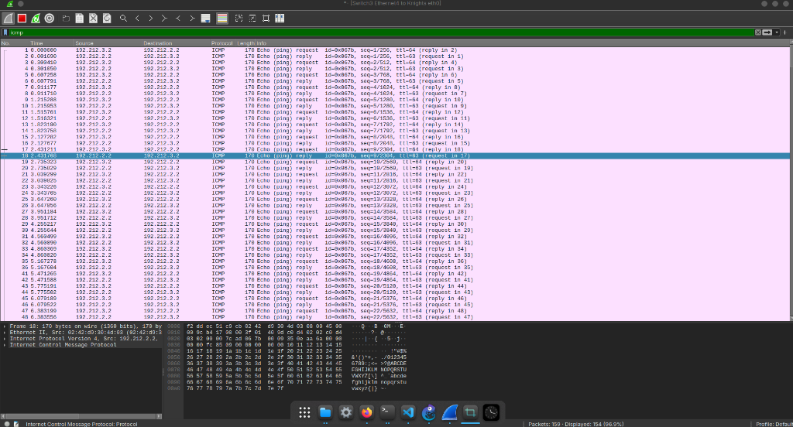
   *Berdasarkan status bar Wireshark, tertangkap tepat **154 paket ICMP** (77 pasang Echo Request dan Echo Reply beruntun dengan interval waktu 0.3 detik).*

3. **Analisis Nilai ICMP Type dan Code**:

   * **Echo (ping) Request (Knights $\rightarrow$ Chisa)**:
     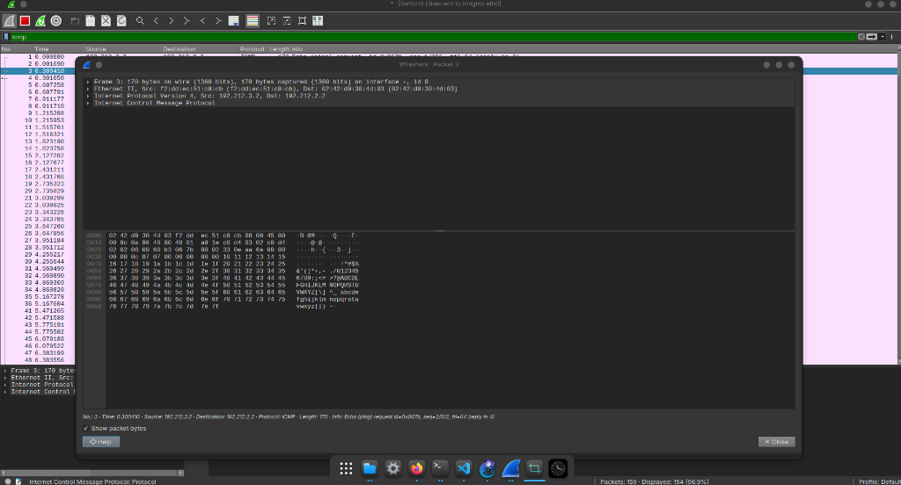
     *Tercatat pada paket **No. 3** (dan seluruh paket ganjil permintaan):*
     - **Source**: `192.212.3.2` (Knights)
     - **Destination**: `192.212.2.2` (Chisa)
     - **ICMP Type**: `8` *(Echo (ping) request)*
     - **ICMP Code**: `0`
     - **Payload Data**: 128 bytes (panjang total frame pada wire adalah 170 bytes)

   * **Echo (ping) Reply (Chisa $\rightarrow$ Knights)**:
     
     *Tercatat pada paket **No. 4** (dan seluruh paket genap jawaban):*
     - **Source**: `192.212.2.2` (Chisa)
     - **Destination**: `192.212.3.2` (Knights)
     - **ICMP Type**: `0` *(Echo (ping) reply)*
     - **ICMP Code**: `0`
     - **TTL**: 63 *(berkurang 1 hop dari 64 saat diteruskan oleh Router Lain)*

---

## Soal 11

>Dikerjakan Oleh Zaki

### Soal
> Buktikan kelemahan protokol Telnet dengan membuat akun `phantom_user` dan password `wired_ghost` pada layanan `telnetd` di node Chisa. Lakukan login Telnet dari node Eiri ke node Chisa dan tangkap sesi menggunakan Wireshark. Tunjukkan kredensial plain text melalui fitur Follow TCP Stream, serta jelaskan mengapa setiap karakter terkirim dalam paket TCP terpisah.

### Langkah Pengerjaan

1. **Konfigurasi Layanan Telnet di Server Chisa**:
   - Memasang utilitas daemon `telnetd` (tersedia melalui paket `busybox-extras`).
   - Mendaftarkan akun Linux baru dengan username `phantom_user` dan password `wired_ghost`.
   - Menjalankan daemon `telnetd` pada port 23 menggunakan script `/root/setup_telnet_chisa.sh`:
     ```bash
     apk update && apk add --no-cache busybox-extras

     adduser -D -s /bin/sh phantom_user 2>/dev/null || true
     echo "phantom_user:wired_ghost" | chpasswd

     killall telnetd 2>/dev/null || true
     telnetd -p 23

     netstat -tlpn | grep 23
     ```

2. **Packet Sniffing dengan Wireshark**:
   Mengaktifkan penangkapan paket (*live capture*) pada antarmuka link antara `Eiri` (`eth0`) dan `Switch3` di GNS3, kemudian menerapkan display filter:
   ```text
   telnet || tcp.port == 23
   ```

3. **Remote Login dari Node Eiri**:
   Melakukan koneksi Telnet dari node Eiri (`192.212.3.3`) ke server Chisa (`192.212.2.2`):
   ```bash
   apk update && apk add --no-cache busybox-extras
   telnet 192.212.2.2
   ```
   - Masukkan username: `phantom_user`
   - Masukkan password: `wired_ghost`
   - Jalankan perintah `whoami` untuk verifikasi sesi, lalu keluar menggunakan perintah `exit`.

4. **Rekonstruksi Aliran Data (Follow TCP Stream)**:
   Pada Wireshark, klik kanan salah satu paket Telnet lalu pilih menu **Follow $\rightarrow$ TCP Stream** untuk mengamati data sesi dua arah secara utuh.

### Bukti dan Hasil

1. **Status Layanan Telnet di Node Chisa**:
   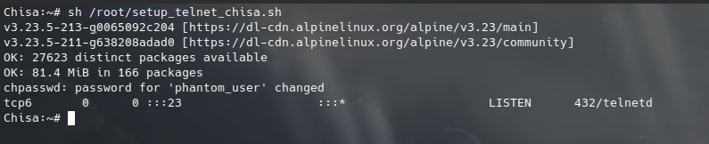
   *Port `23` berstatus `LISTEN` dijalankan oleh proses `telnetd` (PID 432).*

2. **Bukti Remote Login Berhasil di Node Eiri**:
   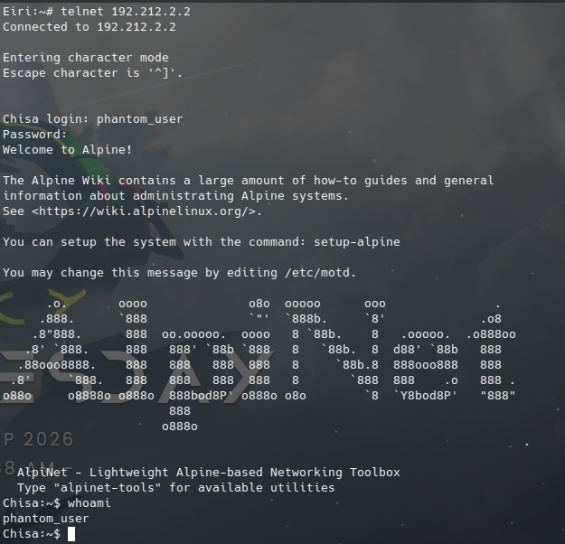
   *Node Eiri berhasil terhubung ke Chisa dalam `character mode`, menyelesaikan proses login, dan perintah `whoami` mengonfirmasi identitas sesi sebagai `phantom_user`.*

3. **Analisis Kredensial Plain Text pada Wireshark (Follow TCP Stream)**:
   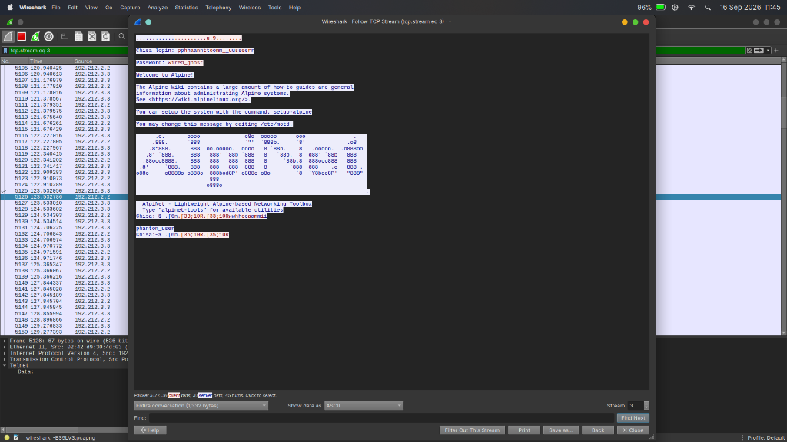
   *Rekonstruksi aliran TCP memperlihatkan celah keamanan fatal pada protokol Telnet:*
   - **Teks Terbuka Murni (Plaintext)**: Seluruh kredensial ditransmisikan tanpa enkripsi apa pun:
     - **Username**: `phantom_user`
     - **Password**: `wired_ghost`
   - **Duplikasi Karakter Username (`pphhaannttoomm__uusseerr`)**: Pada saat pengetikan username, client mengirimkan karakter (teks merah) dan server langsung memantulkannya kembali (teks biru) sebagai mekanisme *Remote Echo* agar karakter tersebut muncul pada layar terminal pengguna.
   - **Karakter Password Tidak Digandakan**: Pada saat memasukkan password, server mematikan fungsi *echo* lokal/remote sehingga hanya paket dari client (teks merah `wired_ghost`) yang melintas di jaringan. Meskipun tidak terlihat di layar terminal, data sandi tersebut tetap terkirim secara telanjang (*in the clear*) di saluran TCP.

4. **Penjelasan Mengapa Setiap Karakter Terkirim dalam Paket TCP Terpisah**:
   Berdasarkan daftar paket pada Wireshark (seperti paket No. 5105 hingga 5150 dengan panjang frame 67-68 bytes), setiap ketukan tombol keyboard dikirimkan dalam paket TCP mandiri dengan muatan (*payload*) data sebesar 1 byte karena:
   - **Mode Operasi Telnet (*Character-at-a-Time Mode*)**: Secara baku, Telnet bekerja menggunakan spesifikasi NVT (*Network Virtual Terminal*) dalam mode interaktif karakter. Setiap kali pengguna menekan satu tombol keyboard, *terminal line discipline* pada sistem operasi client langsung mengemas karakter tersebut ke dalam satu segmen TCP dan mengirimkannya ke server tanpa menunggu tombol Enter ditekan.
   - **Mekanisme Remote Echo**: Server Telnet bertanggung jawab untuk memvalidasi dan memantulkan (*echoing back*) kembali setiap karakter ke layar pengguna. Hal ini memerlukan pengiriman seketika (*instantaneous delivery*) agar pengguna tidak merasakan jeda (lag) saat mengetik.
   - **Penonaktifan Nagle's Algorithm (`TCP_NODELAY`)**: Untuk menjaga responsivitas terminal interaktif, implementasi klien Telnet secara baku menonaktifkan algoritma penggabungan buffer Nagle. Akibatnya, setiap karakter tunggal (1 byte) langsung dikirim bersama overhead header TCP (32 bytes), IP (20 bytes), dan Ethernet (14 bytes).

---

## Soal 12

>Dikerjakan Oleh Zaki

### Soal
> Alice mencurigai Knights menjalankan beberapa layanan rahasia di node-nya. Lakukan pemindaian port dari node Alice ke node Knights menggunakan Netcat (nc) untuk memeriksa port 22 (SSH) dan 80 (HTTP) dalam keadaan terbuka, serta port rahasia 7777 dalam keadaan tertutup. Analisis di Wireshark perbedaan TCP Flag yang dikembalikan antara port terbuka (SYN-ACK) dengan port tertutup (RST-ACK).

### Langkah Pengerjaan

1. **Konfigurasi Layanan pada Node Target (Knights)**:
   - Memasang daemon OpenSSH (`sshd`) dan BusyBox HTTP server (`httpd`) pada node Knights (`192.212.3.2`).
   - Menginisialisasi kunci host SSH (`ssh-keygen -A`), lalu mengaktifkan layanan port 22 dan port 80 menggunakan script `/root/setup_services_knights.sh`:
     ```bash
     apk update && apk add --no-cache openssh busybox-extras

     ssh-keygen -A
     /usr/sbin/sshd
     httpd -p 80

     netstat -tlpn | grep -E '22|80'
     ```
   - Membiarkan port 7777 dalam kondisi tertutup (tidak ada layanan yang mendengarkan).

2. **Packet Sniffing dengan Wireshark**:
   Mengaktifkan penangkapan paket (*live capture*) pada antarmuka link antara `Alice` (`eth0`) dan `Switch1` di GNS3, kemudian menerapkan display filter:
   ```text
   tcp.port == 22 || tcp.port == 80 || tcp.port == 7777
   ```

3. **Eksekusi Pemindaian Port dari Node Alice**:
   Memasang utilitas `netcat-openbsd` pada node Alice (`192.212.1.2`), lalu melakukan pemindaian ke alamat IP Knights (`192.212.3.2`) pada port 22, 80, dan 7777 menggunakan script `/root/scan_alice.sh`:
   ```bash
   apk update && apk add --no-cache netcat-openbsd

   nc -zv -w 2 192.212.3.2 22
   nc -zv -w 2 192.212.3.2 80
   nc -zv -w 2 192.212.3.2 7777
   ```

### Bukti dan Hasil

1. **Status Layanan Port Terbuka di Node Knights**:
   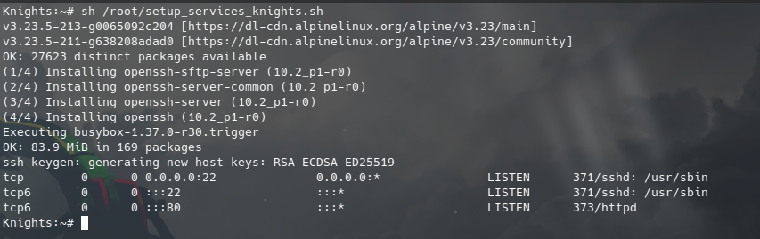
   *Perintah `netstat -tlpn` membuktikan bahwa port 22 (`sshd`) dan port 80 (`httpd`) aktif mendengarkan koneksi (`LISTEN`), sementara port 7777 tidak terdaftar.*

2. **Hasil Pemindaian Port pada Terminal Alice**:
   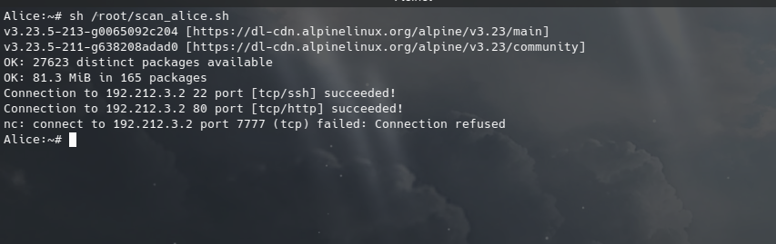
   *Keluaran terminal Netcat menunjukkan status port secara akurat:*
   - `Connection to 192.212.3.2 22 port [tcp/ssh] succeeded!` *(Port 22 Terbuka)*
   - `Connection to 192.212.3.2 80 port [tcp/http] succeeded!` *(Port 80 Terbuka)*
   - `nc: connect to 192.212.3.2 port 7777 (tcp) failed: Connection refused` *(Port 7777 Tertutup)*

3. **Aliran Paket dan Perbedaan TCP Flag pada Wireshark**:
   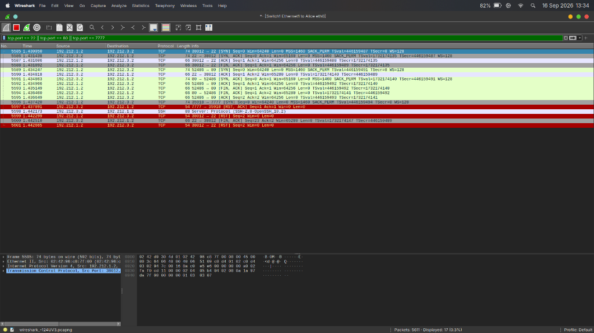
   *Tangkapan paket memperlihatkan perbedaan mendasar respon protokol TCP antara port terbuka dan port tertutup:*

   * **Port Terbuka — Port 22 (SSH) dan Port 80 (HTTP)**:
     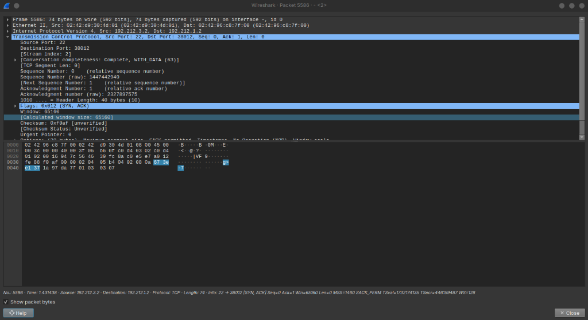
     - Saat Alice menginisiasi pemindaian dengan paket **`[SYN]`** (Paket No. 5585 untuk port 22 dan Paket No. 5589 untuk port 80), server Knights merespons dengan paket:
       $$\text{Flags: 0x012 [SYN, ACK]}$$
     - **Arti Teknis**: Bit **Synchronize (SYN)** dan **Acknowledgment (ACK)** keduanya bernilai `1`. Server menyatakan siap menerima sesi koneksi dan melanjutkan proses *TCP Three-Way Handshake*. Setelah menerima `[SYN, ACK]`, Netcat pada client segera merespons dengan `[ACK]` lalu memutus koneksi karena opsi zero-I/O (`-z`) hanya bertujuan menguji ketersediaan port.

   * **Port Tertutup — Port 7777**:
     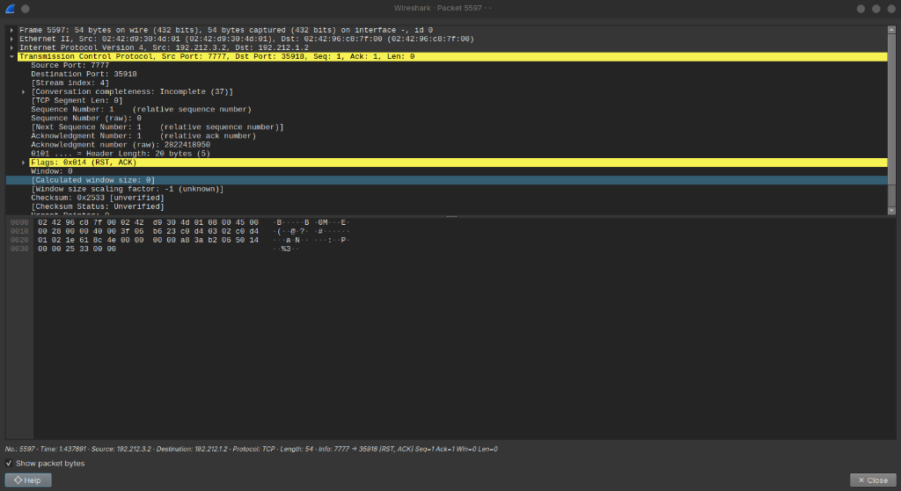
     - Saat Alice mengirimkan inisiasi koneksi **`[SYN]`** ke port 7777 (Paket No. 5596), kernel target Knights seketika mengembalikan paket balasan (Paket No. 5597):
       $$\text{Flags: 0x014 [RST, ACK]}$$
     - **Arti Teknis**: Bit **Reset (RST)** dan **Acknowledgment (ACK)** aktif dengan ukuran *Window Size = 0*. Karena tidak ada aplikasi (*listening socket*) yang terikat pada port 7777, subsistem TCP/IP pada kernel Linux secara otomatis menolak koneksi dan menginstruksikan pengirim bahwa port tersebut tidak dapat dihubungi (*Connection refused*).

---

## Soal 13: Konfigurasi Remote Login Aman via SSH Key-Based Authentication

>Dikerjakan Oleh Zaki

### Deskripsi Masalah

Untuk menjaga kerahasiaan administrasi sistem dari penyadapan jaringan (*eavesdropping*), node **Mika** (`192.212.1.3`) memerlukan akses *remote terminal* yang aman ke node **Knights** (`192.212.3.2`). Knights dikonfigurasi agar hanya mengizinkan autentikasi berbasis kunci publik (*Public Key Authentication*) bagi pengguna `mika_admin` serta secara tegas menonaktifkan autentikasi berbasis kata sandi (*Password Authentication*). Selain itu, pertukaran kunci kriptografi harus dianalisis menggunakan Wireshark untuk membuktikan keunggulan keamanan SSH dibandingkan protokol teks polos seperti Telnet.

---

### Langkah Konfigurasi

#### 1. Konfigurasi Kunci SSH pada Node Mika (`192.212.1.3`)

Pada node Mika, dibuat akun `mika_admin` serta pasangan kunci kriptografi RSA 2048-bit tanpa passphrase:

```bash
cat << 'EOF' > /root/setup_ssh_mika.sh
apk update && apk add --no-cache openssh-client

adduser -D -s /bin/sh mika_admin 2>/dev/null || true

mkdir -p /home/mika_admin/.ssh
chmod 700 /home/mika_admin/.ssh

rm -f /home/mika_admin/.ssh/id_rsa*
ssh-keygen -t rsa -b 2048 -f /home/mika_admin/.ssh/id_rsa -N ""

chown -R mika_admin:mika_admin /home/mika_admin/.ssh

cat /home/mika_admin/.ssh/id_rsa.pub
EOF
```

Jalankan skrip di terminal Mika:
```bash
sh /root/setup_ssh_mika.sh
```

#### 2. Konfigurasi SSH Server pada Node Knights (`192.212.3.2`)

Pada node Knights, dibuat akun `mika_admin`, didaftarkan kunci publik Mika ke `authorized_keys`, serta dikonfigurasi berkas `/etc/ssh/sshd_config` untuk menolak autentikasi kata sandi:

```bash
cat << 'EOF' > /root/setup_ssh_knights.sh
adduser -D -s /bin/sh mika_admin 2>/dev/null || true
echo "mika_admin:wired123" | chpasswd

mkdir -p /home/mika_admin/.ssh
chmod 700 /home/mika_admin/.ssh

echo "ssh-rsa AAAAB3NzaC1yc2EAAAADAQABAAABAQC05Q6G7mDSvudIz7fISJrVS8zEnflyQNzK7fdzYxrNkWPUoZsCQMuj5jRoZtMU9zP+Qzz2aE05P5MoELObTpoG018B0NYKiakASmoSelqrR+bk32q89r73PnhDwmIkmjeysNg+ixkvhmX4La3PCXyeIPC+Z52uer0JuRYzyl93u1B/5Hd4aQV32HvLziTTzHbbJJV4eTORwHYwEL5RoxIDsN2xnGzBl9AKwSgC08L3sFeCFINEfJ6EnBw5AdvixyqcrmaWeqqOeY55p7/vjyxEcWz6ihXr2+QdElxcQ5MgEEetL6sT98KK8HhNOmRgsSPJgKiEc2zQ/Ow/Y5Y5potd root@Mika" > /home/mika_admin/.ssh/authorized_keys

chmod 600 /home/mika_admin/.ssh/authorized_keys
chmod 755 /home/mika_admin
chown -R mika_admin:mika_admin /home/mika_admin

echo "PubkeyAcceptedAlgorithms +ssh-rsa" >> /etc/ssh/sshd_config
echo "PubkeyAuthentication yes" >> /etc/ssh/sshd_config
echo "PasswordAuthentication no" >> /etc/ssh/sshd_config

killall sshd 2>/dev/null || true
/usr/sbin/sshd
EOF
```

Jalankan skrip di terminal Knights:
```bash
sh /root/setup_ssh_knights.sh
```

#### 3. Pengujian Koneksi SSH dari Mika ke Knights

Login dilakukan dari pengguna `mika_admin` di node Mika menuju Knights (`192.212.3.2`):
```bash
su - mika_admin -c "ssh -o StrictHostKeyChecking=no mika_admin@192.212.3.2"
```

---

### Bukti dan Hasil

1. **Pembuatan Pasangan Kunci SSH RSA pada Mika**:
   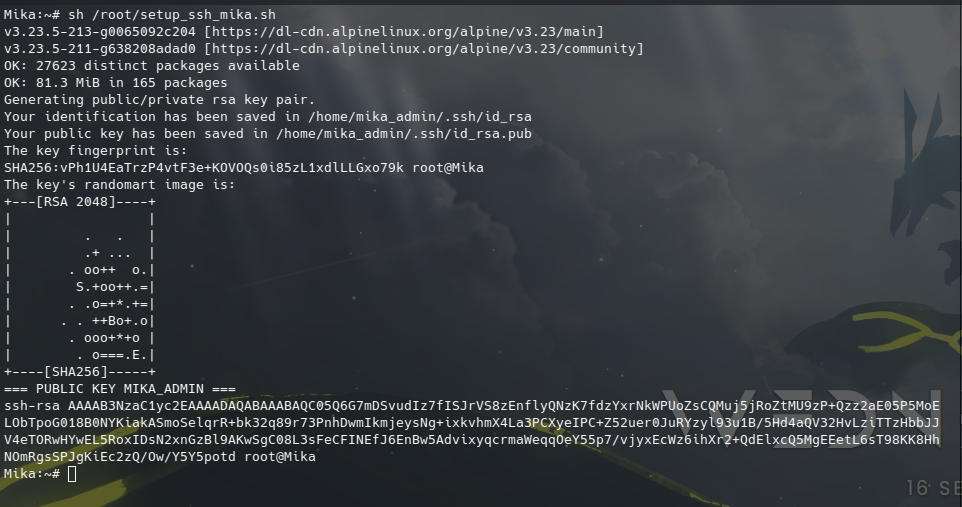
   *Proses pembuatan kunci privat `id_rsa` dan kunci publik `id_rsa.pub` dengan algoritma RSA 2048-bit berhasil dieksekusi.*

2. **Pengujian Login SSH Berbasis Kunci Publik ke Knights**:
   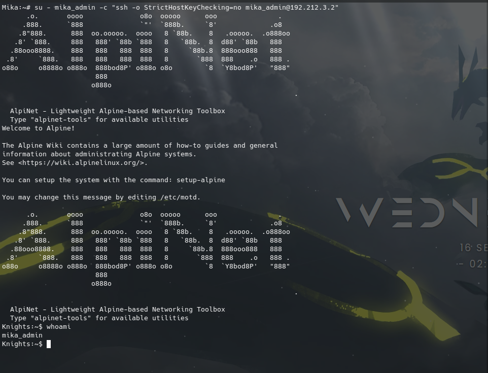
   *Pengguna `mika_admin` pada Mika berhasil login ke node target Knights (`192.212.3.2`) secara instan tanpa dimintai kata sandi interaktif, membuktikan bahwa mekanisme Public Key Authentication berfungsi.*

3. **Analisis Protokol SSH pada Wireshark**:
   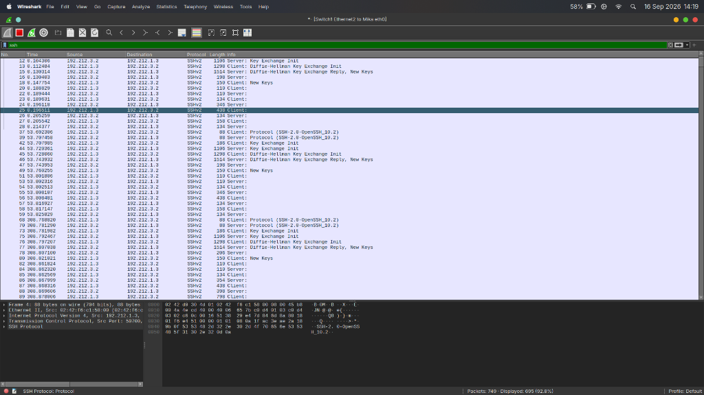
   *Aliran paket memperlihatkan tahapan negosiasi dan pembentukan terowongan enkripsi SSHv2 secara bertahap:*

   * **Protocol Version Exchange (Paket No. 37 & 39)**:
     - Mika mengirimkan: `SSH-2.0-OpenSSH_10.2`
     - Knights membalas: `SSH-2.0-OpenSSH_10.2`
     - Kedua pihak menyepakati versi protokol SSHv2. Tahap ini merupakan bagian terakhir yang ditransmisikan dalam format teks terbaca (*cleartext identification string*).

   * **Key Exchange Initialization / KEXINIT (Paket No. 42 & 44)**:
     - Client dan server saling bertukar daftar algoritma kriptografi yang didukung, mencakup *Key Exchange Algorithm* (seperti `curve25519-sha256` atau `ecdh-sha2-nistp256`), *Server Host Key Algorithm* (`rsa-sha2-512`, `ssh-ed25519`), *Encryption Cipher* (`chacha20-poly1305`, `aes128-gcm`), dan algoritma integritas (MAC).

   * **Diffie-Hellman Key Exchange & New Keys (Paket No. 45, 46, 49)**:
     - Paket No. 45 & 46 memproses pertukaran Diffie-Hellman di mana kedua entitas menghitung *shared secret key* bersama secara matematis tanpa pernah mentransmisikan kunci rahasia tersebut melintasi medium jaringan (*secure key derivation*).
     - Knights memverifikasi identitasnya menggunakan host key privatnya.
     - Paket No. 46 dan 49 mengirimkan pesan `New Keys`, yang menandakan bahwa algoritma enkripsi simetris yang telah disepakati mulai diaktifkan.

   * **Enkripsi Penuh Seluruh Sesi (Paket No. 51 ke atas)**:
     - Segera setelah pertukaran `New Keys`, seluruh pertukaran data selanjutnya—termasuk otentikasi kunci pengguna, eksekusi shell, penekanan tombol, dan keluaran terminal—dikemas dalam paket terenkripsi (*Encrypted packet*).
     - **Perbandingan dengan Telnet (Soal 11)**: Pada protokol Telnet, setiap byte karakter termasuk *username* dan *password* dikirimkan dalam bentuk teks polos (*plaintext*) yang dapat dibaca secara langsung oleh siapapun yang menyadap lalu lintas jaringan. Sebaliknya, SSH menjamin tiga pilar keamanan informasi: **Confidentiality** (data terenkripsi rapat), **Integrity** (data dilindungi oleh MAC terhadap manipulasi), dan **Authentication** (keaslian identitas terjamin via tanda tangan digital kunci kriptografi).

---

## Soal 14: Analisis Serangan Brute Force Form Login Web via HTTP

>Dikerjakan Oleh Anggun

### Deskripsi Masalah

Setelah gagal mengakses FTP, Eiri melancarkan serangan brute-force terhadap form login web Alice. Analisis berkas tangkapan paket `wired_bruteforce.pcapng` dilakukan untuk mengidentifikasi alamat IP penyerang, target IP beserta port yang diserang, password user `lain_admin` yang berhasil ditembus, serta web server software dan versi yang dilaporkan pada response header. Validasi temuan kemudian disubmit pada socket server:
$$\text{nc } [IP\_Group] \text{ 3401}$$

---

### Langkah Pengerjaan & Analisis

1. **Membuka dan Menyaring Berkas Pcap di Wireshark**:
   - Berkas `wired_bruteforce.pcapng` dibuka pada Wireshark.
   - Filter display `http` atau `http.request.method == "POST"` diterapkan untuk memusatkan perhatian pada percobaan pengiriman data form login `/login.php`.
2. **Identifikasi Aktivitas Serangan**:
   - Terlihat ratusan paket HTTP POST dikirimkan secara masif dan terotomatisasi dengan User-Agent `Fuzz Faster U Fool v2.1.0-dev` (ffuf).
   - Hampir seluruh request dibalas oleh server dengan status `HTTP/1.1 401 Unauthorized` dan payload `<h1>Error! Invalid credentials.</h1>`.
3. **Menemukan Kredensial yang Berhasil Ditembus**:
   - Untuk menemukan percobaan yang berhasil, diterapkan filter `http.response.code == 200`.
   - Ditemukan satu respons berhasil pada paket nomor 351 (`HTTP/1.1 200 OK`) dengan isi `<h1>Success! Login successful.</h1>` yang merespons paket nomor 350 (`POST /login.php`).
   - Pada request body paket 350 tertera kredensial:
     $$\text{username=lain\_admin\&password=wired\_pr0tocol\_7}$$
4. **Identifikasi Header dan Entitas Jaringan**:
   - **Alamat IP Penyerang**: `172.26.7.50` (alamat sumber pada request)
   - **Target IP dan Port**: `172.26.7.100:8080` (alamat tujuan dan port layanan web)
   - **Web Server Software & Versi**: `Apache/2.4.62` (diperoleh dari header respons `Server: Apache/2.4.62` serta `X-Powered-By: PHP/8.3.14`)
5. **Validasi pada Socket Server**:
   Hubungkan terminal ke server validasi:
   ```bash
   nc 10.4.89.246 3401
   ```
   Masukkan jawaban sesuai parameter yang ditemukan hingga mendapatkan flag.

---

### Bukti dan Hasil

1. **Validasi Socket Server & Flag Soal 14**:
   
   *Hasil interaksi socket server memvalidasi keempat jawaban dengan benar dan memberikan flag:*
   $$\text{KOMJAR26\{W1r3d\_Brut3\_zUmnRKoYtFnup0nQaG7EVr3Uw\}}$$

2. **Daftar Paket Serangan Brute Force pada Wireshark**:
   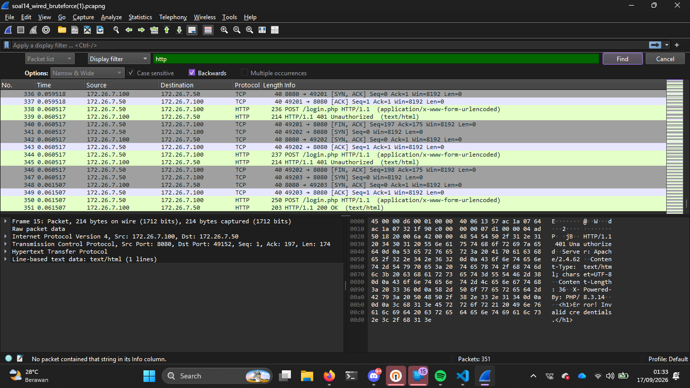
   *Tangkapan Wireshark memperlihatkan rentetan percobaan login yang gagal (`401 Unauthorized`) hingga diakhiri oleh satu respons sukses (`200 OK`) pada paket No. 351.*

3. **Identifikasi Alamat IP Penyerang dan Target**:
   
   *Header Internet Protocol Version 4 membuktikan pengirim request berada pada IP `172.26.7.50` dan server target pada IP `172.26.7.100`.*

4. **Follow HTTP Stream Percobaan Berhasil**:
   
   *Aliran HTTP Stream merekonstruksi kredensial yang valid (`username=lain_admin&password=wired_pr0tocol_7`), header server `Apache/2.4.62`, dan pesan konfirmasi `<h1>Success! Login successful.</h1>`.*

---

## Soal 15: Rekonstruksi Keystroke Hardware Malicious USB HID

>Dikerjakan Oleh Anggun

### Deskripsi Masalah

Eiri menyusup ke ruang server dan memasang perangkat keyboard USB berbahaya pada node Alice. Dari berkas tangkapan paket `wired_usb_hid.pcap`, dilakukan identifikasi Vendor ID dan Product ID perangkat USB dari deskriptor USB, alamat nomor device USB yang dialokasikan, serta pesan rahasia yang berhasil dicuri dari rekaman keystroke hardware. Validasi temuan disubmit pada socket server:
$$\text{nc } [IP\_Group] \text{ 3402}$$

---

### Langkah Pengerjaan & Analisis

1. **Membuka Berkas Pcap USB di Wireshark**:
   - Berkas `wired_usb_hid.pcap` dibuka menggunakan Wireshark yang mendukung pembongkaran paket protokol USB (*USBPcap pseudoheader*).
2. **Identifikasi Vendor ID dan Product ID**:
   - Pada proses enumerasi USB awal, host meminta Device Descriptor (`GET DESCRIPTOR Response DEVICE`).
   - Pada frame respons descriptor, field `idVendor` dan `idProduct` terbaca secara gamblang:
     - **Vendor ID**: `0x046d` (Logitech, Inc.)
     - **Product ID**: `0xc31c` (Keyboard K120)
3. **Identifikasi Alamat Nomor Device USB**:
   - Setelah enumerasi dan konfigurasi `SET ADDRESS`, host mengalokasikan Device Address spesifik untuk keyboard tersebut.
   - Pada header USB URB, field `Device address` tercatat bernilai **`7`** (`Source: 2.7.1`).
4. **Ekstraksi dan Dekode Keystroke dari Data HID**:
   - Diterapkan filter display untuk memilah paket interupsi penekanan tombol:
     ```text
     usb.transfer_type == 0x01 && usb.src == "2.7.1"
     ```
   - Setiap kali tombol ditekan, perangkat HID mengirimkan 8-byte input report pada `Leftover Capture Data` (misalnya `0000150000000000`):
     - **Byte 0 (Modifier Keys)**: `0x02` atau `0x20` mengindikasikan tombol Shift (huruf kapital).
     - **Byte 2 (Keycode HID)**: Kode tombol sesuai standar USB HID Usage Table (contoh: `0x1a` = W/w, `0x0c` = I/i, `0x15` = R/r, `0x08` = E/e, `0x07` = D/d, `0x2d` = `_`, `0x24` = 7, dst.).
   - Menerjemahkan seluruh urutan scancode keycode HID menghasilkan pesan rahasia:
     $$\text{Wired\_Protocol\_7\_is\_alive\_2026}$$
5. **Validasi pada Socket Server**:
   Hubungkan terminal ke server validasi:
   ```bash
   nc 10.4.89.246 3402
   ```
   Masukkan Vendor ID (`0x046d`), Product ID (`0xc31c`), Device address (`7`), dan pesan terdekode (`Wired_Protocol_7_is_alive_2026`).

---

### Bukti dan Hasil

1. **Validasi Socket Server & Flag Soal 15**:
   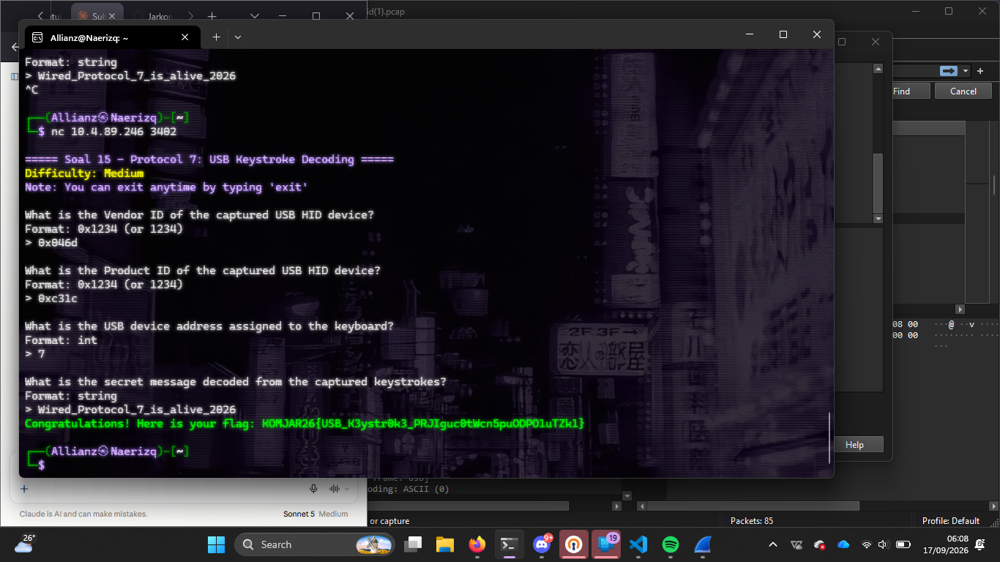
   *Socket server mengonfirmasi seluruh parameter perangkat USB dan memberikan flag:*
   $$\text{KOMJAR26\{USB\_K3ystr0k3\_PRJiguc0tWcn5puODP0lUTZkl\}}$$

2. **Identifikasi USB Device Descriptor (Vendor & Product ID)**:
   
   *Deskriptor perangkat memperlihatkan manufaktur `Logitech, Inc.` dengan `idVendor: 0x046d` dan `idProduct: 0xc31c`.*

3. **Alamat Nomor Device USB pada Header URB**:
   
   *Field `Device address: 7` teridentifikasi pada struktur USB Request Block (URB).*

4. **Filter dan Paket USB Keystroke Interrupt**:
   
   *Filter `usb.transfer_type == 0x01 && usb.src == "2.7.1"` menampilkan aliran paket interrupt transfer dari keyboard.*

5. **Payload Leftover Capture Data Keystroke**:
   
   *Data byte HID scancode `0000150000000000` merepresentasikan sinyal penekanan tombol keyboard yang kemudian didekode.*

6. **Daftar Aliran Paket Keystroke Lengkap**:
   
   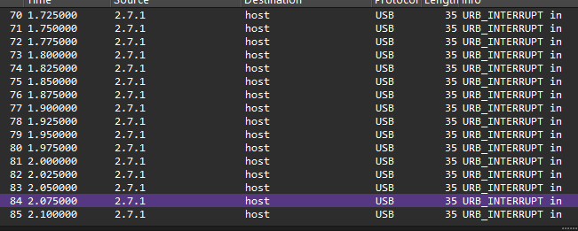
   *Urutan transmisi interupsi USB yang secara berkesinambungan mengirimkan penekanan tombol pesan rahasia.*

---

## Soal 16: Analisis Lalu Lintas Eksfiltrasi Malware via FTP

>Dikerjakan Oleh Anggun

### Deskripsi Masalah

Eiri meletakkan file malware di server. Dari berkas tangkapan paket `wired_ftp_theft.pcap`, dilakukan analisis lalu lintas FTP untuk mengidentifikasi alamat IP server FTP penyerang, banner software FTP yang digunakan, kredensial login penyerang, serta ukuran (*size in bytes*) dari file malware `knights_payload.exe` yang diunduh. Validasi temuan disubmit pada socket server:
$$\text{nc } [IP\_Group] \text{ 3403}$$

---

### Langkah Pengerjaan & Analisis

1. **Membuka Berkas Pcap di Wireshark**:
   - Berkas `wired_ftp_theft.pcap` dibuka di Wireshark.
   - Filter display `ftp` diterapkan untuk memfilter seluruh lalu lintas *control channel* (TCP port 21).
2. **Menganalisis Aliran Sesi FTP via Follow TCP Stream**:
   - Klik kanan pada salah satu paket FTP lalu pilih **Follow -> TCP Stream**.
   - Seluruh percakapan protokol FTP terbaca secara teks polos (*plaintext*):
     - **Banner Server**: Server menyambut koneksi dengan banner `220 Welcome to Wired FTP Server (vsftpd 3.0.5)`.
     - **Autentikasi Pengguna**:
       $$\text{USER knights\_agent}$$
       $$\text{PASS N4v1\_s3cur3\_2026}$$
       $$\text{230 Login successful.}$$
     - **Pengecekan Ukuran File Malware**: Klien mengirimkan perintah `SIZE knights_payload.exe` yang dibalas server dengan `213 524288` (berukuran tepat **524288** byte).
     - **Pengunduhan Berkas**: Klien beralih ke mode pasif (`PASV`) dan mengunduh berkas dengan perintah `RETR knights_payload.exe`.
3. **Identifikasi Alamat IP Jaringan**:
   - **IP Server FTP Penyerang**: `198.51.100.7` (penyedia file malware)
   - **IP Klien Pengunduh**: `10.7.3.50`
4. **Validasi pada Socket Server**:
   Hubungkan terminal ke server validasi:
   ```bash
   nc 10.4.89.246 3403
   ```
   Masukkan IP server (`198.51.100.7`), banner (`Wired FTP Server (vsftpd 3.0.5)`), kredensial (`knights_agent:N4v1_s3cur3_2026`), dan ukuran file (`524288`).

---

### Bukti dan Hasil

1. **Validasi Socket Server & Flag Soal 16**:
   
   *Socket server memvalidasi seluruh parameter eksfiltrasi FTP dan menerbitkan flag:*
   $$\text{KOMJAR26\{FTP\_Th3ft\_new132kNdhh40hiLyj6K6VeXU\}}$$

2. **Follow TCP Stream Sesi Kontrol FTP**:
   
   *Rekonstruksi sesi kontrol FTP menampilkan kredensial login, banner vsftpd 3.0.5, dan alur eksekusi transfer file.*

3. **Kueri Ukuran File Malware (SIZE Command)**:
   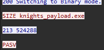
   *Perintah `SIZE knights_payload.exe` membuktikan ukuran payload malware adalah tepat 524288 byte.*

4. **Permintaan Pengunduhan Berkas (RETR Command)**:
   
   *Daftar paket membuktikan permintaan unduhan file menuju server FTP `198.51.100.7`.*

---

## Soal 17: Investigasi Pengunduhan Malware HTTP Command & Control (C2)

>Dikerjakan Oleh Anggun

### Deskripsi Masalah

Alice membuat halaman web di node miliknya. Eiri memanfaatkan celah keamanan untuk mengunduh payload berbahaya ke sistem Alice. Berkas tangkapan paket `wired_http_c2.pcap` dianalisis untuk mengidentifikasi nama domain (*Host*) tempat malware diunduh, alamat IP server penyerang, nama file executable malware yang diunduh, serta kode status HTTP yang dikembalikan. Validasi temuan disubmit pada socket server:
$$\text{nc } [IP\_Group] \text{ 3404}$$

---

### Langkah Pengerjaan & Analisis

1. **Membuka Berkas Pcap di Wireshark**:
   - Berkas `wired_http_c2.pcap` dibuka di Wireshark.
   - Filter display `http` diterapkan untuk mengisolasi transaksi Hypertext Transfer Protocol.
2. **Menemukan Permintaan Unduhan Payload**:
   - Pada paket No. 30, terdeteksi request `GET /navi_agent.exe HTTP/1.1` dari IP internal `10.7.1.50` ke IP eksternal `203.0.113.42`.
3. **Menganalisis Header dan Payload via Follow HTTP Stream**:
   - Klik kanan paket No. 30 -> **Follow -> HTTP Stream**.
   - **Request**:
     - Request URI: `/navi_agent.exe`
     - Host: **`wired-update.net`**
     - User-Agent: `Mozilla/5.0 (Windows NT 10.0; Win64; x64)`
   - **Response**:
     - Status Line: `HTTP/1.1 200 OK` (Status code: **`200`**)
     - Server: `nginx/1.24.0`
     - Content-Disposition: `attachment; filename="navi_agent.exe"`
     - Magic Bytes Binary: Teks header executable Windows `MZ` (*"This program cannot be run in DOS mode."*), membuktikan berkas tersebut adalah executable PE biner.
4. **Parameter Temuan**:
   - **Domain (Host)**: `wired-update.net`
   - **IP Server Penyerang**: `203.0.113.42`
   - **Nama File Malware**: `navi_agent.exe`
   - **HTTP Status Code**: `200`
5. **Validasi pada Socket Server**:
   Hubungkan terminal ke server validasi:
   ```bash
   nc 10.4.89.246 3404
   ```
   Masukkan parameter temuan di atas hingga mendapatkan flag.

---

### Bukti dan Hasil

1. **Validasi Socket Server & Flag Soal 17**:
   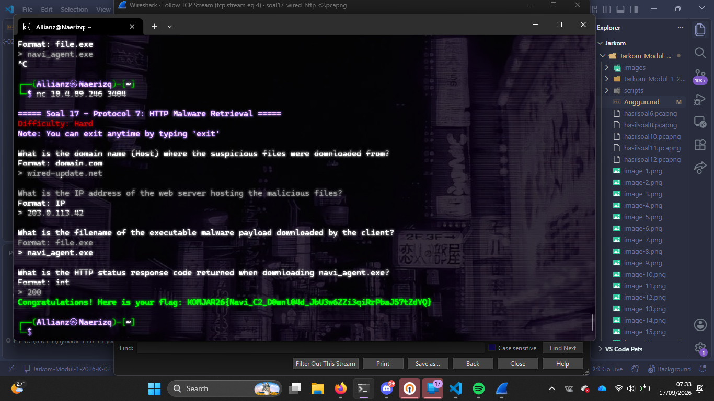
   *Socket server memvalidasi keempat informasi pengunduhan malware HTTP C2 dan mengembalikan flag:*
   $$\text{KOMJAR26\{Navi\_C2\_D0wnl04d\_JbU3w6ZZi3qiRrPbaJ57tZdYQ\}}$$

2. **Follow HTTP Stream Pengunduhan Malware**:
   
   *Stream HTTP memperlihatkan host target `wired-update.net`, file `navi_agent.exe`, status respons `200 OK`, dan stub DOS biner executable.*

3. **Daftar Paket IP dan Permintaan HTTP GET**:
   
   *Paket No. 30 mengonfirmasi bahwa klien `10.7.1.50` mengunduh payload dari IP server penyerang `203.0.113.42`.*

---

## Soal 18: Analisis Pergerakan Lateral Malware via Protokol SMB

>Dikerjakan Oleh Anggun

### Deskripsi Masalah

Eiri mengubah taktik penyerangan dengan menanamkan file malware menggunakan protokol file sharing SMB. Berkas tangkapan paket `wired_smb_transfer.pcapng` dianalisis untuk mengidentifikasi nama protokol jaringan yang dieksploitasi, IP pengirim dan penerima, folder tujuan penyimpanan malware pada sistem korban, serta nama file executable malware yang ditransfer. Validasi temuan disubmit pada socket server:
$$\text{nc } [IP\_Group] \text{ 3405}$$

---

### Langkah Pengerjaan & Analisis

1. **Membuka Berkas Pcap di Wireshark**:
   - Berkas `wired_smb_transfer.pcapng` dibuka pada Wireshark.
   - Filter display `smb2` diterapkan untuk menyaring lalu lintas Server Message Block versi 2.
2. **Identifikasi Dialek Protokol dan Perangkat Terlibat**:
   - Protokol file sharing yang digunakan adalah **`SMB2`**.
   - **Host Pengirim (Attacker Delivering Malware)**: `10.7.3.100` (port sumber dinamis 49152).
   - **Host Penerima / Korban (Victim Receiving Malware)**: `10.7.1.50` (port tujuan standar SMB 445).
3. **Menganalisis Tree Connect dan File Creation**:
   - Pada Frame 14, terjadi negosiasi `Tree Connect Request` menuju shared folder administratif:
     $$\text{Tree: } \backslash\backslash 10.7.1.50\backslash\text{ADMIN\$}$$
     Target folder share yang dituju adalah **`ADMIN$`**.
   - Pada Frame 16 (Paket No. 230), pengirim mengirimkan instruksi `Create Request`:
     $$\text{File: System32}\backslash\text{wired\_trojan\_payload.exe}$$
   - Pada Frame 132, file ditutup setelah data biner malware selesai ditulis (`Close Request`).
4. **Parameter Temuan**:
   - **Nama Protokol**: `SMB2`
   - **IP Pengirim (Source Host)**: `10.7.3.100`
   - **IP Penerima (Victim Host)**: `10.7.1.50`
   - **Folder Tujuan (Target Share)**: `ADMIN$`
   - **Nama File Executable Malware**: `wired_trojan_payload.exe`
5. **Validasi pada Socket Server**:
   Hubungkan terminal ke server validasi:
   ```bash
   nc 10.4.89.246 3405
   ```
   Masukkan kelima parameter yang diminta hingga flag tercetak.

---

### Bukti dan Hasil

1. **Validasi Socket Server & Flag Soal 18**:
   
   *Socket server memvalidasi data pergerakan lateral SMB dan mengembalikan flag:*
   $$\text{KOMJAR26\{SMB\_Tr4nsf3r\_4ln6wNXcJUhAwQSUnxwaPIUVa\}}$$

2. **Identifikasi Protokol SMB2 dan Create Request**:
   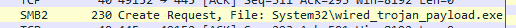
   *Wireshark menampilkan protokol `SMB2` dengan perintah `Create Request` pada file `System32\wired_trojan_payload.exe`.*

3. **Alamat IP Pengirim dan Penerima**:
   
   *Paket No. 16 membuktikan paket berasal dari `10.7.3.100` menuju korban `10.7.1.50`.*

4. **Target Administrative Share `ADMIN$`**:
   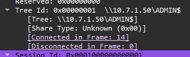
   *Struktur `Tree Id` membuktikan pengaksesan direktori share `\\10.7.1.50\ADMIN$`.*

5. **Penutupan File Malware (Close Request)**:
   
   *Paket No. 132 mengonfirmasi penyelesaian transfer berkas `wired_trojan_payload.exe`.*

---

## Soal 19: Investigasi Email Pemerasan dan Ancaman via Protokol SMTP

>Dikerjakan Oleh Anggun

### Deskripsi Masalah

Eiri meneror jaringan dengan mengirimkan email pemerasan melalui protokol SMTP tanpa enkripsi. Dari berkas tangkapan paket `wired_smtp_threat.pcap`, dilakukan analisis stream TCP terkait untuk mengidentifikasi alamat email korban yang ditargetkan, password korban yang diklaim bocor oleh penyerang, jenis malware yang diinfeksikan, batas waktu (dalam hari) yang diberikan untuk pembayaran tebusan, serta `MailClientID` yang tercantum pada pesan. Validasi temuan disubmit pada socket server:
$$\text{nc } [IP\_Group] \text{ 3406}$$

---

### Langkah Pengerjaan & Analisis

1. **Membuka Berkas Pcap di Wireshark**:
   - Berkas `wired_smtp_threat.pcap` dibuka di Wireshark.
   - Filter display `smtp` diterapkan untuk memfilter lalu lintas pengiriman email pada port 25.
2. **Menemukan Paket Email Ancaman**:
   - Pada Paket No. 86, terdeteksi pertukaran email dari IP pengirim `185.234.72.19` ke server penerima `203.0.113.100` dengan subjek:
     `URGENT: Your Wired account has been compromised`
3. **Membaca Isi Pesan via Follow TCP Stream**:
   - Klik kanan paket No. 86 -> **Follow -> TCP Stream**.
   - Karena transaksi menggunakan SMTP murni tanpa TLS (*STARTTLS*), seluruh isi email terbaca dalam format teks terbuka:
     - **Pengirim**: `attacker@darkwired.net`
     - **Penerima / Korban**: `victim@protocol7.co.jp`
     - **Klaim Password Bocor**:
       *“I have compromised your system through Protocol 7. I know that: pr0tocol_7_user - is your password!”*
     - **Jenis Malware**:
       *“Your computer was infected with my private ransomware.”*
     - **Batas Waktu Pembayaran**:
       *“I give you 72 hours (3 days) to get the bitcoins and pay.”*
     - **Alamat Tebusan Bitcoin**: `bc1qxy2kgdygjrsqtzq2n0yrf2493p83kkfjhx0wlh`
     - **Identifier Pesan**:
       `MailClientID: 7719980706`
4. **Parameter Temuan**:
   - **Alamat Email Korban**: `victim@protocol7.co.jp`
   - **Password Korban yang Bocor**: `pr0tocol_7_user`
   - **Jenis Malware**: `ransomware`
   - **Batas Waktu (Hari)**: `3`
   - **MailClientID**: `7719980706`
5. **Validasi pada Socket Server**:
   Hubungkan terminal ke server validasi:
   ```bash
   nc 10.4.89.246 3406
   ```
   Masukkan kelima jawaban yang diperoleh untuk memperoleh flag.

---

### Bukti dan Hasil

1. **Validasi Socket Server & Flag Soal 19**:
   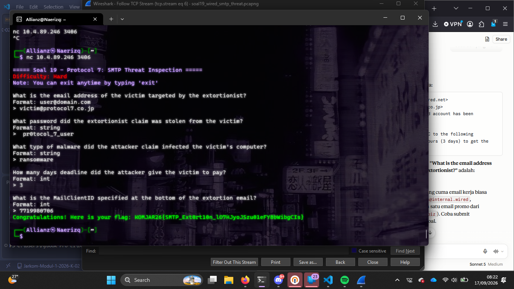
   *Socket server memvalidasi data investigasi ancaman email SMTP dan memberikan flag:*
   $$\text{KOMJAR26\{SMTP\_Ext0rt10n\_l07HJyoJSzu01eFY8bWibgCIs\}}$$

2. **Daftar Paket SMTP Pengiriman Email**:
   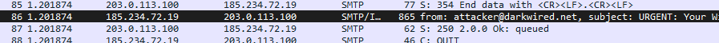
   *Tangkapan paket memperlihatkan pengiriman pesan SMTP dari IP penyerang `185.234.72.19` ke mail server `203.0.113.100`.*

3. **Follow TCP Stream Pesan Email Pemerasan**:
   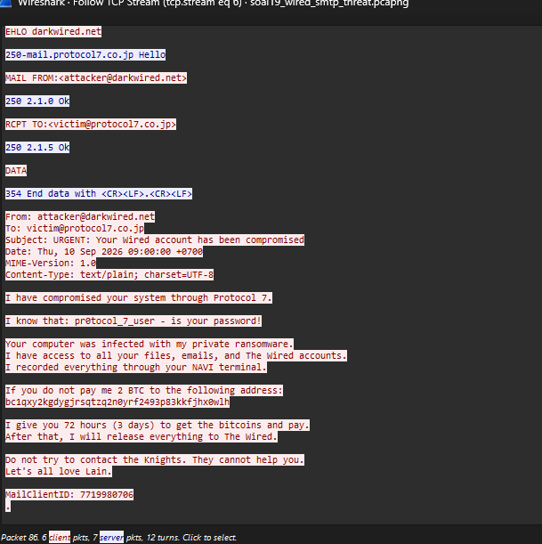
   *Rekonstruksi seluruh stream TCP memperlihatkan teks pesan pemerasan secara utuh termasuk alamat email korban, password yang bocor, jenis malware, batas waktu 3 hari, dan MailClientID.*

---

## Soal 20: Dekripsi Sesi Terenkripsi TLS Menggunakan Keylog File

>Dikerjakan Oleh Anggun

### Deskripsi Masalah

Untuk rencana pamungkasnya, Eiri menyembunyikan komunikasi malware di balik saluran terenkripsi TLS. Namun Alice telah menyediakan berkas keylog untuk mendekripsi lalu lintas data tersebut. Dari berkas tangkapan paket `wired_tls_decrypt.pcapng` bersama berkas kunci `keyslogfile.txt`, dilakukan analisis untuk mengidentifikasi versi protokol TLS yang dinegosiasikan, nama domain (*SNI*) yang diakses, alamat IP server HTTPS penyerang, User-Agent yang digunakan, serta HTTP request method dan path yang tersembunyi di dalam sesi dekripsi. Validasi temuan disubmit pada socket server:
$$\text{nc } [IP\_Group] \text{ 3407}$$

---

### Langkah Pengerjaan & Analisis

1. **Konfigurasi Dekripsi TLS pada Wireshark**:
   - Di Wireshark, buka menu **Edit -> Preferences** (shortcut `Ctrl + Shift + P`).
   - Masuk ke tab **Protocols -> TLS**.
   - Pada kolom **(Pre)-Master-Secret log filename**, klik tombol **Browse** lalu arahkan ke berkas `keyslogfile.txt`.
   - Klik **OK**. Wireshark secara otomatis mencocokkan Client Random pada handshake dengan secret key untuk mendekripsi lapisan TLS.
2. **Analisis Handshake TLS**:
   - **Versi Protokol TLS**: Terbaca pada kolom protokol Wireshark dan TLS Record Layer sebagai **`TLSv1.2`**.
   - **Alamat IP Server HTTPS**: Paket ditransmisikan antara klien `10.9.0.2` dan server tujuan **`93.184.216.34`**.
   - **Nama Domain (SNI)**: Buka paket `Client Hello` -> ekstensi `server_name` -> terbaca **`example.com`**.
3. **Menganalisis Payload HTTP yang Telah Didekripsi**:
   - Setelah kunci dimasukkan, payload terenkripsi didekripsi secara transparan sehingga memunculkan tab **Decrypted TLS** dan protokol layer **HTTP**.
   - Klik kanan pada paket HTTP yang didekripsi -> **Follow -> HTTP Stream**:
     - Request Line: `HEAD / HTTP/1.1` (Method: **`HEAD`**, Path: **`/`**)
     - Header Host: `example.com`
     - Header User-Agent: **`curl/7.62.0`**
     - Response Status: `HTTP/1.1 200 OK`
4. **Parameter Temuan**:
   - **Versi Protokol TLS**: `TLSv1.2`
   - **Nama Domain (SNI / Host)**: `example.com`
   - **IP Server HTTPS**: `93.184.216.34`
   - **User-Agent**: `curl/7.62.0`
   - **HTTP Request Method & Path**: `HEAD /` (atau `HEAD`)
5. **Validasi pada Socket Server**:
   Hubungkan terminal ke server validasi:
   ```bash
   nc 10.4.89.246 3407
   ```
   Masukkan kelima jawaban yang diperoleh hingga flag terakhir diterbitkan.

---

### Bukti dan Hasil

1. **Validasi Socket Server & Flag Soal 20**:
   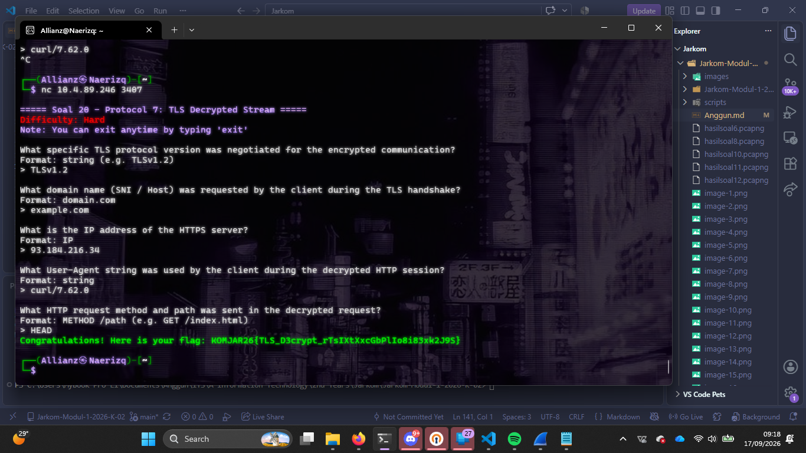
   *Socket server memvalidasi kelima jawaban hasil dekripsi TLS dan memberikan flag:*
   $$\text{KOMJAR26\{TLS\_D3crypt\_rTsIXtXxcGbPIio8i83xk2J95\}}$$

2. **Identifikasi Versi Protokol TLSv1.2 dan IP Server**:
   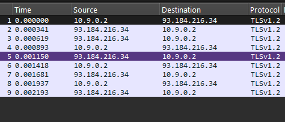
   *Daftar paket membuktikan negosiasi protokol `TLSv1.2` dengan IP server tujuan `93.184.216.34`.*

3. **Identifikasi Server Name Indication (SNI)**:
   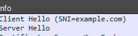
   *Paket Client Hello membuktikan domain target yang diminta klien adalah `example.com`.*

4. **Follow HTTP Stream Hasil Dekripsi TLS**:
   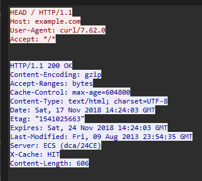
   *Sesi yang berhasil didekripsi memperlihatkan metode `HEAD / HTTP/1.1` dan User-Agent `curl/7.62.0`.*


