# Laporan Resmi Praktikum Modul 1
### Komunikasi Data & Jaringan Komputer 2026

**Kelompok:** K-02  
**Prefix IP Kelompok:** `192.212.x.x`  
**Tema:** *Serial Experiments Lain*  

---

## Soal 1

### Soal
> Untuk mempersiapkan pembangunan The Wired, Lain yang berperan sebagai Router membuat tiga Switch/Gateway: Switch 1 menuju dua Entitas yaitu Alice dan Mika, Switch 2 menuju Chisa, sedangkan Switch 3 menuju Knights dan Eiri. Kelima Entitas tersebut dikonfigurasi sebagai Client di GNS3. [GUNAKAN PREFIX IP MASING-MASING KELOMPOK]

### Langkah Pengerjaan

1. **Menambahkan Node pada GNS3**:
   - 1 node Debian (`debinet-1`) sebagai **Router Lain** (diatur memiliki 4 interface network adapter).
   - 3 node **Ethernet Switch** (`Switch1`, `Switch2`, `Switch3`).
   - 5 node Alpine (`alpinet`) sebagai Client: **Alice**, **Mika**, **Chisa**, **Knights**, dan **Eiri**.

2. **Pengkabelan (Wiring)**:
   - **Router Lain**:
     - `eth0` $\rightarrow$ NAT1
     - `eth1` $\rightarrow$ Switch1
     - `eth2` $\rightarrow$ Switch2
     - `eth3` $\rightarrow$ Switch3
   - **Switch1** $\rightarrow$ Alice (`eth0`), Mika (`eth0`)
   - **Switch2** $\rightarrow$ Chisa (`eth0`)
   - **Switch3** $\rightarrow$ Knights (`eth0`), Eiri (`eth0`)

3. **Konfigurasi Interface (`/etc/network/interfaces`)**:

   - **Router Lain**:
     ```bash
     auto eth0
     iface eth0 inet dhcp

     auto eth1
     iface eth1 inet static
         address 192.212.1.1
         netmask 255.255.255.0

     auto eth2
     iface eth2 inet static
         address 192.212.2.1
         netmask 255.255.255.0

     auto eth3
     iface eth3 inet static
         address 192.212.3.1
         netmask 255.255.255.0
     ```

   - **Alice (`alpinet-1`)**:
     ```bash
     auto eth0
     iface eth0 inet static
         address 192.212.1.2
         netmask 255.255.255.0
         gateway 192.212.1.1
     ```

   - **Mika (`alpinet-2`)**:
     ```bash
     auto eth0
     iface eth0 inet static
         address 192.212.1.3
         netmask 255.255.255.0
         gateway 192.212.1.1
     ```

   - **Chisa (`alpinet-3`)**:
     ```bash
     auto eth0
     iface eth0 inet static
         address 192.212.2.2
         netmask 255.255.255.0
         gateway 192.212.2.1
     ```

   - **Knights (`alpinet-4`)**:
     ```bash
     auto eth0
     iface eth0 inet static
         address 192.212.3.2
         netmask 255.255.255.0
         gateway 192.212.3.1
     ```

   - **Eiri (`alpinet-5`)**:
     ```bash
     auto eth0
     iface eth0 inet static
         address 192.212.3.3
         netmask 255.255.255.0
         gateway 192.212.3.1
     ```

4. **Menjalankan dan Menerapkan Konfigurasi**:
   - Simpan konfigurasi pada setiap node.
   - Jalankan perintah `ifup -a` (atau restart node) di GNS3 agar seluruh konfigurasi antarmuka diterapkan.

### Bukti dan Hasil

1. **Topologi Jaringan di GNS3**:
   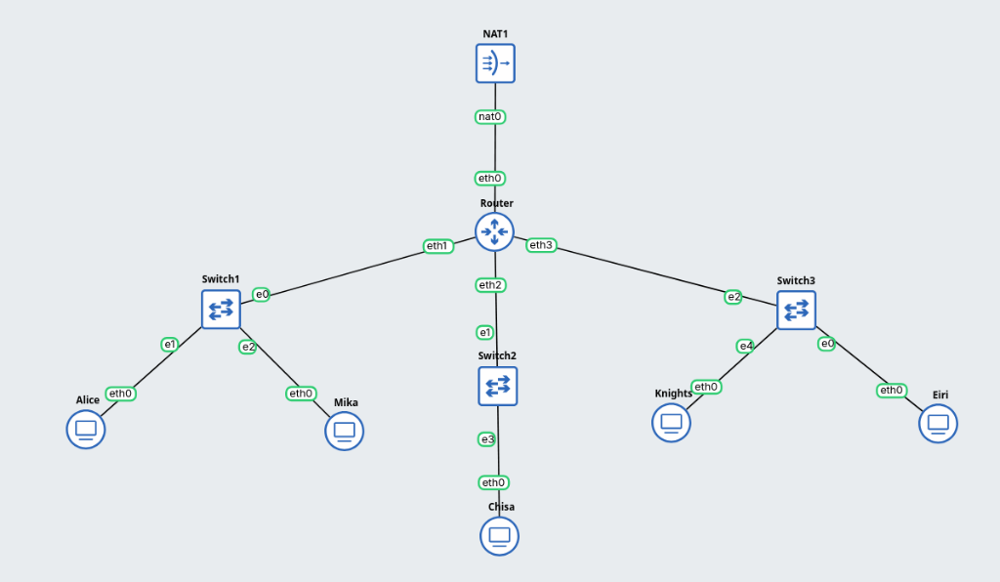

2. **Verifikasi Alamat IP Router Lain (`ip -br a`)**:
   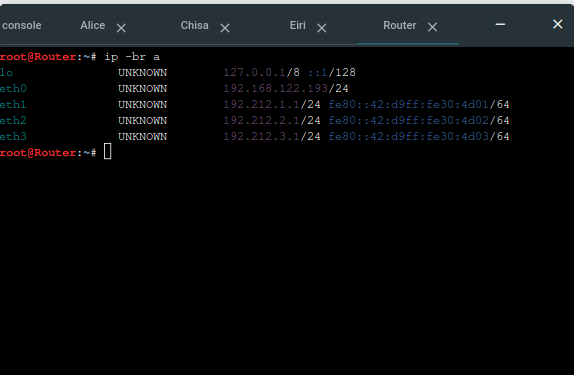

3. **Uji Ping ke Gateway Masing-Masing Subnet**:
   - **Alice $\rightarrow$ Gateway Subnet 1 (`192.212.1.1`)**:
     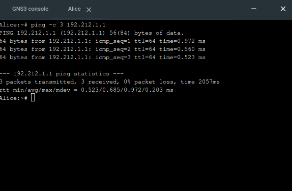

   - **Chisa $\rightarrow$ Gateway Subnet 2 (`192.212.2.1`)**:
     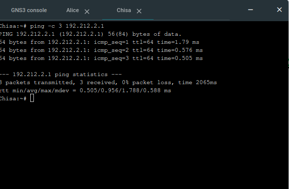

   - **Eiri $\rightarrow$ Gateway Subnet 3 (`192.212.3.1`)**:
     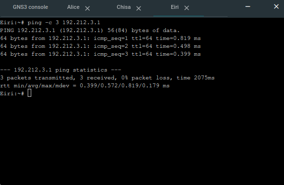

---

## Soal 2

### Soal
> Karena menurut Lain pada saat itu The Wired masih terisolasi dari dunia luar, konfigurasikan router Lain agar dapat tersambung langsung ke jaringan internet publik melalui NAT/DHCP pada interface eth0.

### Langkah Pengerjaan

1. **Konfigurasi DHCP pada Interface `eth0` Router Lain**:
   Menghubungkan interface `eth0` Router Lain ke interface `nat0` pada node `NAT1`, kemudian mengatur `eth0` menggunakan mode DHCP pada file `/etc/network/interfaces`:
   ```bash
   auto eth0
   iface eth0 inet dhcp
   ```

2. **Konfigurasi DNS Resolver**:
   Menambahkan nameserver pada `/etc/resolv.conf` di Router Lain agar dapat melakukan translasi nama domain ke IP internet:
   ```bash
   nameserver 8.8.8.8
   nameserver 1.1.1.1
   ```

3. **Pengujian Konektivitas**:
   Melakukan verifikasi koneksi dari konsol Router Lain dengan mengirimkan ping ke IP publik Google (`8.8.8.8`) dan ke nama domain (`google.com`).

### Bukti dan Hasil

1. **Uji Koneksi Internet Publik (IP & Domain)**:
   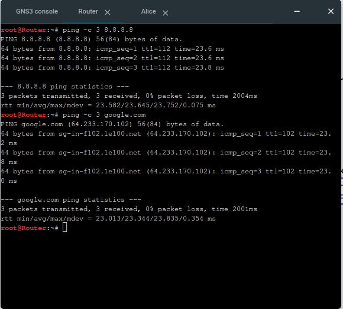
   *Hasil pengujian menunjukkan bahwa Router Lain berhasil tersambung ke jaringan internet publik melalui interface eth0 (DHCP NAT) dengan bukti balasan ping ke `8.8.8.8` dan `google.com` bernilai 0% packet loss.*

---

## Soal 3

### Soal
> Setelah router Lain terhubung ke internet, pastikan seluruh Entitas (Client) di bawah Switch 1, Switch 2, dan Switch 3 dapat saling terhubung dan berkomunikasi satu sama lain melalui konfigurasi routing.

### Langkah Pengerjaan

1. **Mengaktifkan IP Forwarding pada Router Lain**:
   Agar router dapat meneruskan paket antar-interface (antar-subnet yang terhubung langsung ke `eth1`, `eth2`, dan `eth3`), fitur perutean paket pada kernel Linux diaktifkan melalui perintah:
   ```bash
   sysctl -w net.ipv4.ip_forward=1
   ```
   Verifikasi nilai kernel IP forwarding aktif (bernilai `1`):
   ```bash
   cat /proc/sys/net/ipv4/ip_forward
   ```

2. **Pengujian Routing Antar-Entitas (Inter-Subnet)**:
   Melakukan uji konektivitas antar-client yang berada di switch berbeda:
   - Dari **Alice** (`192.212.1.2` di Switch 1) menuju **Chisa** (`192.212.2.2` di Switch 2).
   - Dari **Alice** (`192.212.1.2` di Switch 1) menuju **Knights** (`192.212.3.2` di Switch 3).

### Bukti dan Hasil

1. **Verifikasi IP Forwarding Aktif di Router Lain**:
   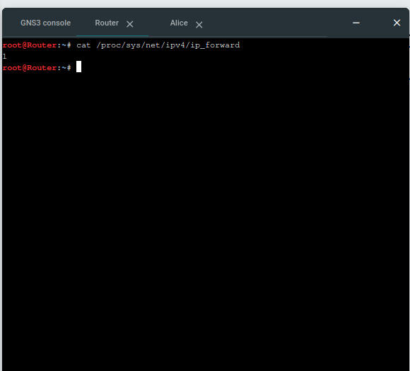
   *Pengecekan `/proc/sys/net/ipv4/ip_forward` menghasilkan nilai `1` yang menandakan Router Lain siap meneruskan lalu lintas antar-subnet.*

2. **Uji Ping Alice ke Chisa (Switch 1 $\rightarrow$ Switch 2)**:
   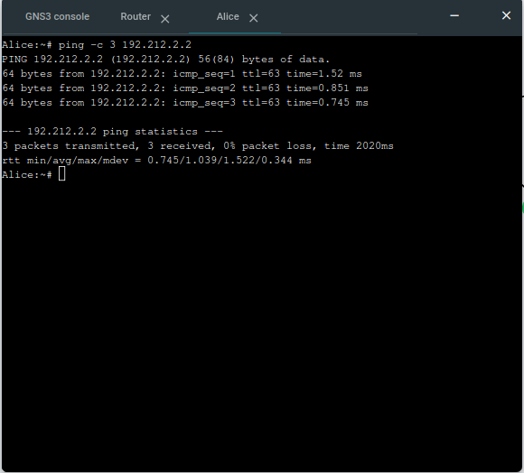
   *Ping dari Alice ke Chisa (`192.212.2.2`) berhasil dengan 0% packet loss dan TTL bernilai 63 (berkurang 1 hop saat melintasi Router Lain).*

3. **Uji Ping Alice ke Knights (Switch 1 $\rightarrow$ Switch 3)**:
   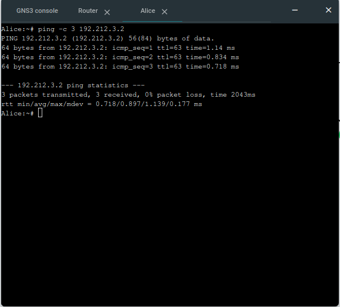
   *Ping dari Alice ke Knights (`192.212.3.2`) berhasil dengan 0% packet loss dan TTL bernilai 63.*

---

## Soal 4

### Soal
> Lain ingin agar setiap Entitas (Client) memiliki kemandirian di The Wired. Konfigurasikan firewall/iptables (NAT Masquerade) dan DNS resolver agar setiap Client dapat terhubung ke internet secara mandiri (dapat melakukan ping ke 8.8.8.8 dan membuka domain web google.com).

### Langkah Pengerjaan

1. **Konfigurasi NAT Masquerade pada Router Lain**:
   Menerapkan aturan iptables pada chain `POSTROUTING` dengan interface keluar `eth0` agar seluruh paket dari segmen LAN (`192.212.x.x`) disamarkan alamat sumbernya menjadi IP milik `eth0` Router saat menuju jaringan luar:
   ```bash
   iptables -t nat -A POSTROUTING -o eth0 -j MASQUERADE
   ```
   Memeriksa tabel NAT untuk memastikan rule aktif:
   ```bash
   iptables -t nat -L -v -n
   ```

2. **Konfigurasi DNS Resolver pada Client**:
   Menambahkan nameserver publik (`8.8.8.8` dan `1.1.1.1`) ke file `/etc/resolv.conf` pada seluruh entitas client agar dapat mengenali nama domain internet:
   ```bash
   nameserver 8.8.8.8
   nameserver 1.1.1.1
   ```

3. **Pengujian Konektivitas Internet dari Client**:
   Melakukan uji coba konektivitas dari konsol client (Eiri) dengan mengirimkan ping ke IP publik (`8.8.8.8`) dan domain web (`google.com`).

### Bukti dan Hasil

1. **Verifikasi Tabel NAT di Router Lain**:
   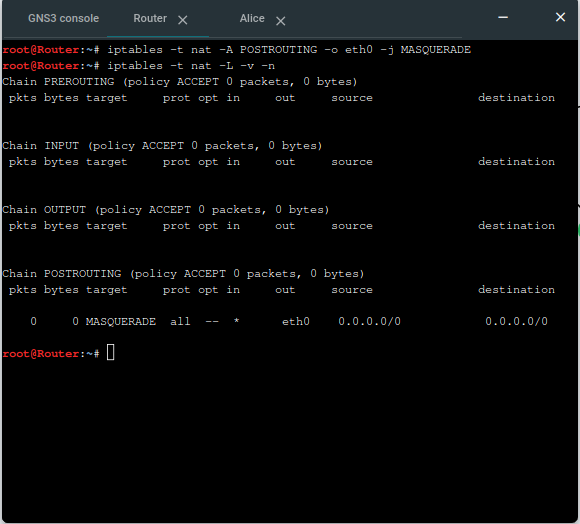
   *Tabel NAT chain POSTROUTING menunjukkan rule target MASQUERADE aktif pada interface eth0 untuk semua traffic (0.0.0.0/0).*

2. **Uji Koneksi Internet dari Client (Eiri)**:
   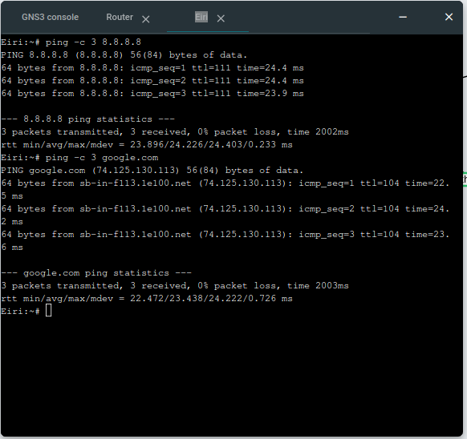
   *Client Eiri (`192.212.3.3`) berhasil melakukan ping ke `8.8.8.8` dan domain web `google.com` dengan 0% packet loss, membuktikan bahwa client memiliki akses internet mandiri via NAT Masquerade dan DNS resolver.*

---

## Soal 5

### Soal
> Eiri tetap berupaya menanamkan kekacauan ke dalam jaringan. Untuk mengantisipasi restart tiba-tiba, pastikan seluruh konfigurasi jaringan tidak hilang saat semua node di-restart. Buat script verifikasi di `/root/cek_status.sh` pada router Lain yang menampilkan ringkasan interface (`ip -br a`) dan status tabel NAT (`iptables -t nat -L -v -n`) setelah reboot.

### Langkah Pengerjaan

1. **Menjaga Persistensi Konfigurasi Jaringan**:
   Seluruh konfigurasi interface, kernel IP forwarding, iptables NAT Masquerade, dan DNS didaftarkan ke dalam file `/etc/network/interfaces` serta dibuatkan script otomatisasi `/root/init.sh` yang dipanggil melalui `/root/.bashrc` agar dieksekusi secara otomatis setiap kali sistem menyala.

2. **Pembuatan Script Verifikasi `/root/cek_status.sh`**:
   Membuat script pada direktori root (`/root/cek_status.sh`) di Router Lain yang menampilkan ringkasan IP antarmuka dan tabel NAT:
   ```bash
   cat << 'EOF' > /root/cek_status.sh
   #!/bin/bash
   echo "RINGKASAN INTERFACE"
   ip -br a
   echo ""
   echo "STATUS TABEL NAT (IPTABLES)"
   iptables -t nat -L -v -n
   EOF
   chmod +x /root/cek_status.sh
   ```

3. **Verifikasi Pasca-Reboot**:
   Melakukan restart pada node Router Lain (Stop $\rightarrow$ Start di GNS3), kemudian mengeksekusi `/root/cek_status.sh` untuk membuktikan bahwa konfigurasi tetap bertahan dan tidak hilang.

### Bukti dan Hasil

1. **Pembuatan Script `/root/cek_status.sh`**:
   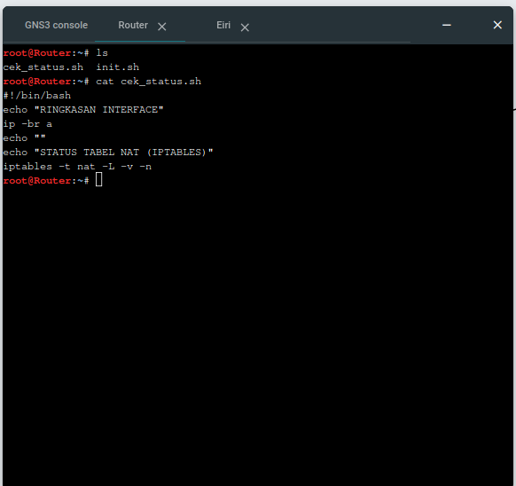
   *Isi file script `/root/cek_status.sh` pada Router Lain.*

2. **Eksekusi Script Pasca-Reboot**:
   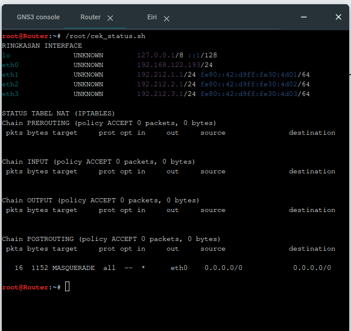
   *Hasil eksekusi `/root/cek_status.sh` setelah reboot membuktikan bahwa seluruh interface (`eth0`, `eth1`, `eth2`, `eth3`) tetap UP dengan pengalamatan IP yang sesuai, serta tabel NAT Masquerade tetap bertahan dan aktif mencatat paket lalu lintas jaringan.*

---

## Soal 6

### Soal
> Mika mencurigai adanya anomali traffic pada segmen jaringannya. Jalankan generator traffic berikut pada node Mika, lalu lakukan packet sniffing menggunakan Wireshark pada interface node Mika. Terapkan display filter khusus untuk menyaring paket yang berprotokol DNS atau ICMP. Tunjukkan screenshot hasil filter beserta ringkasan paket yang lolos.

### Langkah Pengerjaan

1. **Menjalankan Script Generator Traffic**:
   Menjalankan script `/root/traffic_protocol7.sh` pada node Mika untuk menghasilkan anomali lalu lintas data berupa paket ICMP (ping ke berbagai IP) dan query DNS (nslookup & dig ke berbagai domain).

2. **Packet Sniffing dengan Wireshark**:
   Melakukan penyadapan paket (*packet sniffing*) secara live pada link antarmuka antara `Switch1` dan `Mika` (`eth0`) menggunakan Wireshark.

3. **Penerapan Display Filter**:
   Menerapkan display filter khusus untuk memilah paket yang hanya berprotokol DNS atau ICMP:
   ```text
   dns || icmp
   ```

### Bukti dan Hasil

1. **Eksekusi Generator Traffic di Mika**:
   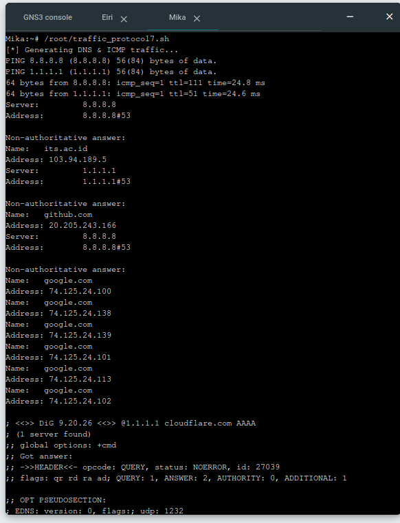
   *Proses eksekusi `/root/traffic_protocol7.sh` pada node Mika berhasil membangkitkan lalu lintas jaringan DNS dan ICMP.*

2. **Hasil Display Filter Wireshark & Ringkasan Paket**:
   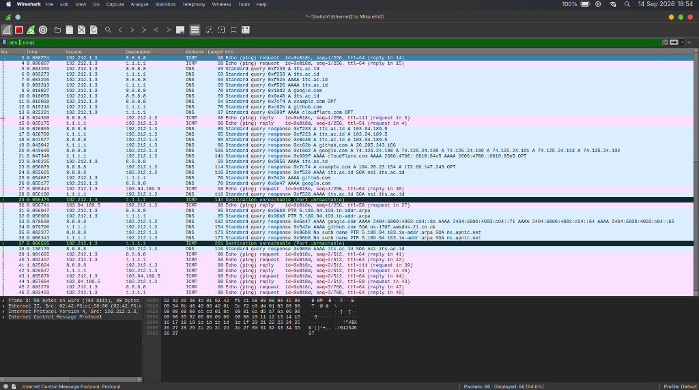
   *Penerapan display filter `dns || icmp` (berwarna hijau) berhasil menyaring seluruh paket terkait. Berdasarkan status bar Wireshark, dari total 66 paket yang tertangkap, terdapat **58 paket (84.8%)** yang lolos filter berprotokol DNS dan ICMP.*

---

## Soal 7

### Soal
> Chisa memutuskan mendirikan FTP Server pada node miliknya dengan shared folder di `/var/wired/data`. Terapkan kebijakan akses: user `alice` (hak akses read & write), user `mika` (dibatasi read-only), dan user `eiri` (dibatasi tanpa izin akses / blacklist). Buktikan konfigurasi dengan membuat file `signal_alice.txt` dari user alice, dan buktikan penolakan akses saat user eiri mencoba login.

### Langkah Pengerjaan

1. **Instalasi dan Konfigurasi FTP Server pada Node Chisa**:
   - Memasang daemon FTP ringan dan aman `vsftpd` pada node Chisa (`192.212.2.2`).
   - Membuat shared folder `/var/wired/data` dengan perizinan penuh (`chmod -R 777 /var/wired/data`).
   - Mendaftarkan akun Linux `alice`, `mika`, dan `eiri` dengan direktori basis `/var/wired/data`.
   - Mengatur kebijakan hak akses:
     - User **Alice** diberikan izin baca dan tulis (`write_enable=YES`) melalui direktori konfigurasi per-user `/etc/vsftpd/user_conf/alice`.
     - User **Mika** dibatasi hanya dapat membaca atau mengunduh saja (`write_enable=NO`) melalui `/etc/vsftpd/user_conf/mika`.
     - User **Eiri** dimasukkan ke dalam daftar hitam `/etc/vsftpd/user_list` dengan mengaktifkan `userlist_deny=YES` sehingga langsung ditolak oleh server saat mencoba login.
   - Mengaktifkan `seccomp_sandbox=NO` agar vsFTPd berjalan stabil di lingkungan container Alpine, serta mengonfigurasi rentang port pasif (`pasv_min_port=30000`, `pasv_max_port=30005`).
   - Skrip konfigurasi otomasi disimpan pada `/root/setup_ftp_chisa.sh`:
     ```bash
     apk update && apk add --no-cache vsftpd
     mkdir -p /var/wired/data /etc/vsftpd/user_conf

     adduser -D -h /var/wired/data -s /bin/sh alice 2>/dev/null || true
     echo "alice:wired123" | chpasswd

     adduser -D -h /var/wired/data -s /bin/sh mika 2>/dev/null || true
     echo "mika:wired123" | chpasswd

     adduser -D -h /var/wired/data -s /bin/sh eiri 2>/dev/null || true
     echo "eiri:wired123" | chpasswd

     chmod -R 777 /var/wired/data

     cat << 'USER_EOF' > /etc/vsftpd/user_conf/alice
     write_enable=YES
     local_root=/var/wired/data
     USER_EOF

     cat << 'USER_EOF' > /etc/vsftpd/user_conf/mika
     write_enable=NO
     local_root=/var/wired/data
     USER_EOF

     echo "eiri" > /etc/vsftpd/user_list

     cat << 'CONF_EOF' > /etc/vsftpd/vsftpd.conf
     listen=YES
     listen_ipv6=NO
     anonymous_enable=NO
     local_enable=YES
     write_enable=YES
     local_umask=022
     dirmessage_enable=YES
     use_localtime=YES
     xferlog_enable=YES
     connect_from_port_20=YES
     local_root=/var/wired/data
     chroot_local_user=YES
     allow_writeable_chroot=YES
     seccomp_sandbox=NO
     user_config_dir=/etc/vsftpd/user_conf
     userlist_enable=YES
     userlist_file=/etc/vsftpd/user_list
     userlist_deny=YES
     pasv_enable=YES
     pasv_min_port=30000
     pasv_max_port=30005
     CONF_EOF

     killall vsftpd 2>/dev/null || true
     /usr/sbin/vsftpd /etc/vsftpd/vsftpd.conf &
     ```

2. **Pengujian Hak Akses Read & Write oleh User Alice**:
   - Menyiapkan berkas `/root/signal_alice.txt` pada node Alice.
   - Melakukan koneksi FTP ke server Chisa (`192.212.2.2`) dan mengunggah berkas menggunakan script `/root/test_ftp_alice.sh`:
     ```bash
     apk update && apk add --no-cache lftp

     echo "Signal from Alice to The Wired - Connection Verified." > /root/signal_alice.txt

     lftp -u alice,wired123 192.212.2.2 << 'FTP_EOF'
     set ftp:ssl-allow no
     put /root/signal_alice.txt
     ls
     bye
     FTP_EOF
     ```

3. **Pengujian Pembatasan Akses (Blacklist) pada User Eiri**:
   - Mencoba melakukan koneksi dan autentikasi sebagai user `eiri` menuju FTP server Chisa dari node Eiri dengan script `/root/test_ftp_eiri.sh`:
     ```bash
     apk update && apk add --no-cache lftp

     lftp -u eiri,wired123 192.212.2.2 << 'FTP_EOF'
     set ftp:ssl-allow no
     ls
     bye
     FTP_EOF
     ```

### Bukti dan Hasil

1. **Status Layanan vsFTPd pada Node Chisa**:
   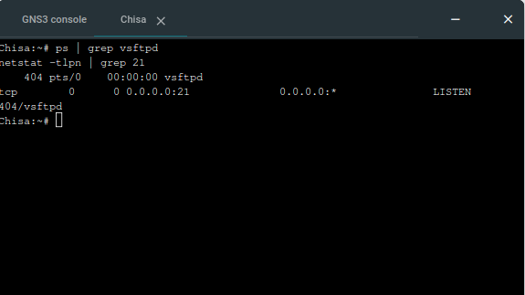
   *Proses `vsftpd` berjalan normal pada latar belakang dan membuka listening socket pada port 21.*

2. **Bukti Upload Berkas `signal_alice.txt` oleh Alice**:
   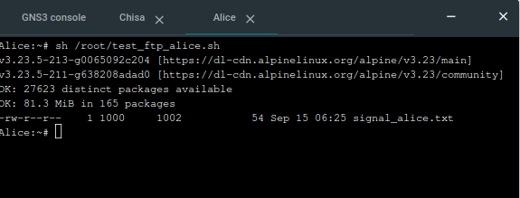
   *User Alice berhasil melakukan autentikasi dan mengunggah berkas `signal_alice.txt` ke shared folder server Chisa, terbukti dari keluaran `ls` yang menampilkan berkas tersebut.*

3. **Verifikasi Keberadaan Berkas di Node Chisa**:
   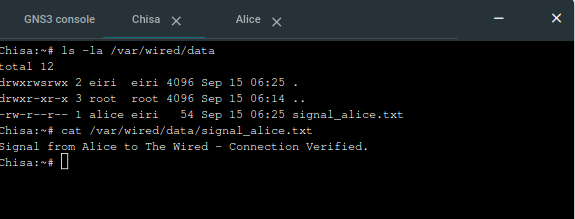
   *Pemeriksaan lokal pada node Chisa melalui `ls -la /var/wired/data` dan `cat` membuktikan bahwa `signal_alice.txt` tersimpan dengan benar di dalam shared folder.*

4. **Bukti Penolakan Akses (Blacklist) pada User Eiri**:
   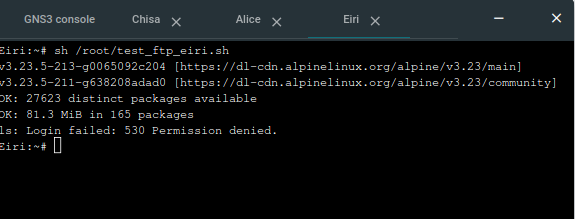
   *Saat user Eiri mencoba melakukan login ke server FTP Chisa, server langsung merespons dengan `530 Permission denied`, membuktikan bahwa mekanisme blacklist berhasil menolak akses login.*

---

## Soal 8

### Soal
> Kelompok rahasia Knights perlu mengirimkan dokumen laporan intelijen ke FTP Server Chisa. Lakukan koneksi FTP client dari node Knights ke FTP Server Chisa menggunakan akun alice. Upload file berikut (`knights_report.txt`). Analisis sesi Wireshark dan sebutkan: perintah FTP untuk upload (STOR), kode status sukses server (226), dan port data TCP yang dinegosiasikan pada mode PASV.

### Langkah Pengerjaan

1. **Persiapan Berkas Laporan Intelijen pada Node Knights**:
   Menyiapkan berkas `/root/knights_report.txt` pada node Knights yang memuat laporan pemantauan The Wired (*LEVEL 7 — EYES ONLY*).

2. **Packet Sniffing dengan Wireshark**:
   Mengaktifkan penangkapan paket (*live capture*) pada antarmuka link antara `Knights` (`eth0`) dan `Switch3` melalui menu **Start capture** di GNS3.

3. **Eksekusi Pengunggahan Berkas dari Node Knights**:
   Melakukan transfer berkas menuju server FTP Chisa (`192.212.2.2`) dengan kredensial akun `alice` dalam mode pasif (`PASV`) menggunakan script `/root/upload_knights.sh`:
   ```bash
   apk update && apk add --no-cache lftp

   cat << 'FILE_EOF' > /root/knights_report.txt
   ==================================================
     KNIGHTS OF THE EASTERN CALCULUS — STATUS REPORT
     Protocol 7 Surveillance Network
     Classification: LEVEL 7 — EYES ONLY
   ==================================================

   Date: [CLASSIFIED]
   Agent: Knights Unit Alpha
   Node: Switch 3 — Subnet 10.<PREFIX>.3.0/24

   ---

   SUBJECT: Network Reconnaissance Report

   The Wired has been successfully infiltrated through
   Protocol 7 channels. Current observations:

   1. Router "Lain" has been identified as the central
      gateway node connecting all three subnet segments.

   2. Switch 1 (10.<PREFIX>.1.0/24) hosts Alice and Mika.
      Both nodes show standard traffic patterns.

   3. Switch 2 (10.<PREFIX>.2.0/24) hosts Chisa alone.
      Isolated subnet — minimal cross-traffic observed.

   4. Switch 3 (10.<PREFIX>.3.0/24) — our operational base.
      Knights and Eiri coexist on this segment.

   RECOMMENDATION:
   Continue monitoring FTP and Telnet sessions for
   plaintext credential exposure. SSH tunnels remain
   impenetrable without keylog access.

   --- END OF REPORT ---
   Knights of the Eastern Calculus
   "Let's all love Lain."
   FILE_EOF

   lftp -u alice,wired123 192.212.2.2 << 'FTP_EOF'
   set ftp:ssl-allow no
   set ftp:passive-mode true
   set net:max-retries 1
   put /root/knights_report.txt
   ls
   bye
   FTP_EOF
   ```

4. **Analisis Protokol pada Wireshark**:
   Menerapkan display filter `ftp || ftp-data` untuk mengamati perintah kontrol dan saluran data yang terbentuk.

### Bukti dan Hasil

1. **Eksekusi Pengunggahan di Node Knights**:
   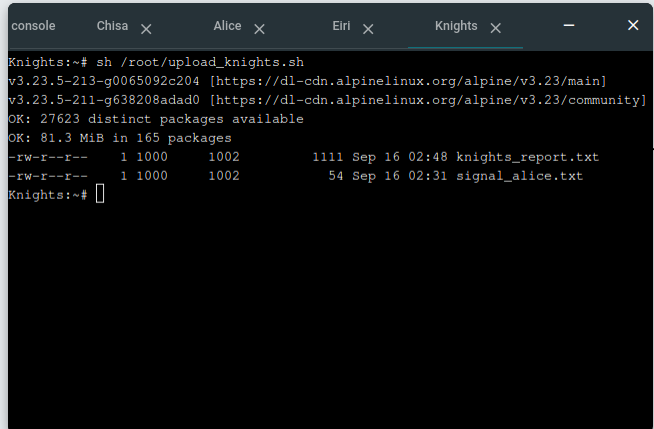
   *Proses eksekusi `/root/upload_knights.sh` pada node Knights berhasil mengunggah berkas `knights_report.txt` (1111 bytes) ke FTP Server Chisa.*

2. **Aliran Sesi Komunikasi FTP pada Wireshark (`ftp || ftp-data`)**:
   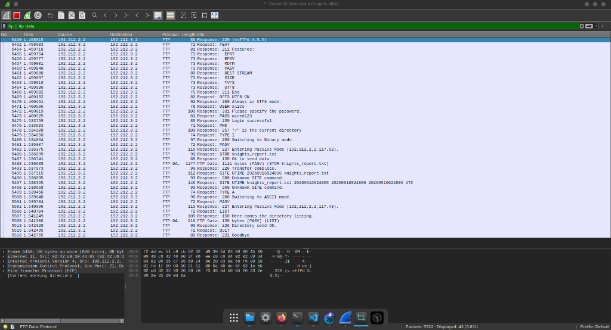
   *Seluruh siklus transmisi terekam dengan jelas, mulai dari autentikasi akun `alice`, negosiasi mode pasif (`PASV`), pengiriman berkas melalui data channel, hingga pemutusan koneksi (`QUIT`).*

3. **Analisis Komponen Sesuai Permintaan Soal**:

   * **Perintah FTP untuk Upload (`STOR`)**:
     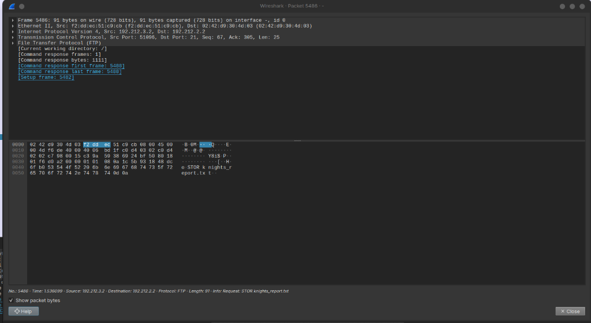
     *Tercatat pada paket **No. 5486**, client Knights mengirimkan perintah:*
     $$\text{Request: STOR knights\_report.txt}$$
     *Perintah ini menginstruksikan server untuk menyimpan aliran data yang dikirimkan ke dalam berkas `knights_report.txt`.*

   * **Kode Status Sukses Server (`226`)**:
     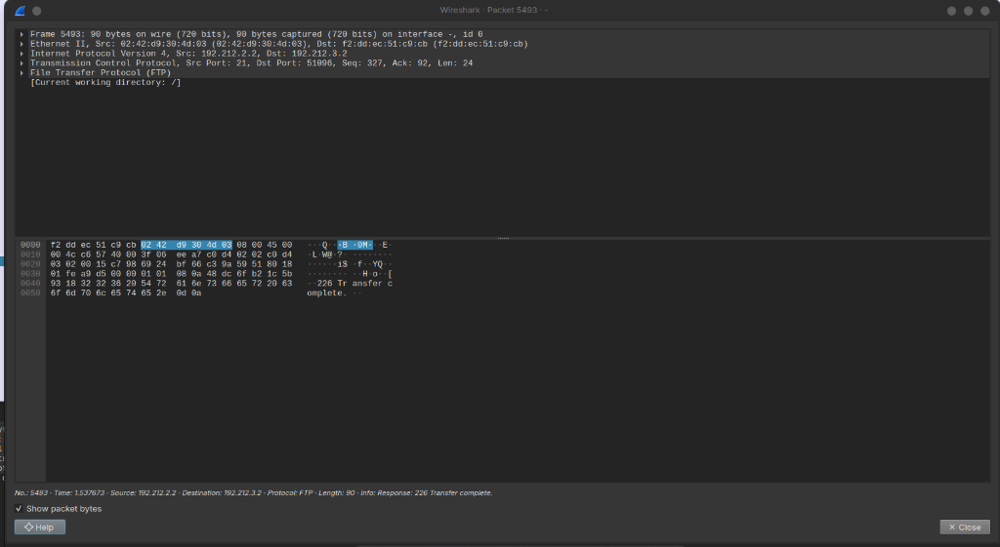
     *Tercatat pada paket **No. 5493**, server Chisa merespons dengan kode status:*
     $$\text{Response: 226 Transfer complete.}$$
     *Menandakan bahwa transfer muatan berkas sebesar 1111 bytes melalui saluran data telah berhasil diterima dan ditutup secara sempurna oleh server.*

   * **Port Data TCP yang Dinegosiasikan pada Mode PASV**:
     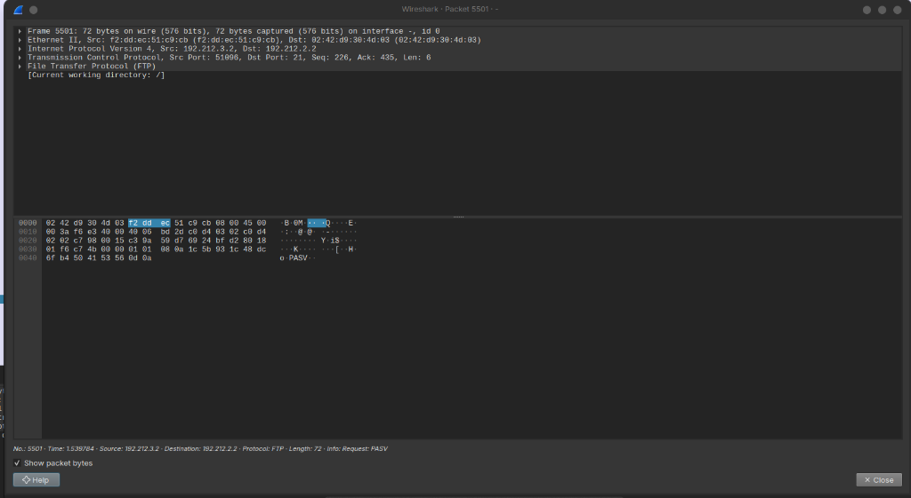
     *Tercatat pada paket **No. 5501** (dan No. 5481), client Knights mengirimkan instruksi `Request: PASV` untuk meminta server membuka data channel dalam mode pasif.*

     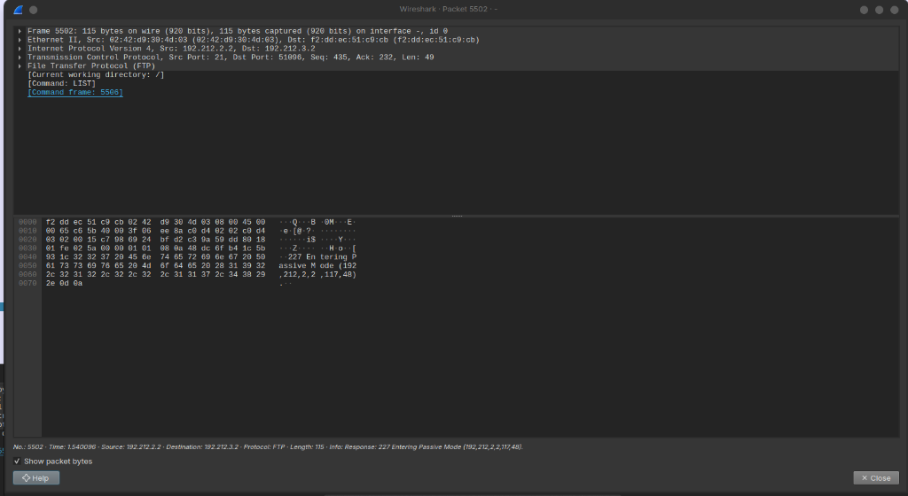
     *Server Chisa membalas permintaan tersebut dengan respons kode status 227 (Paket No. 5502):*
     $$\text{Response: 227 Entering Passive Mode (192,212,2,2,117,48)}$$
     *Alamat IP data server adalah `192.212.2.2` dan nomor port TCP data pasif dihitung dari dua oktet terakhir:*
     $$\text{Port TCP Data} = (117 \times 256) + 48 = 29952 + 48 = \mathbf{30000}$$
     *(Pada sesi pengunggahan berkas di paket No. 5482 sebelumnya, negosiasi menghasilkan `(192,212,2,2,117,52)` dengan port TCP $(117 \times 256) + 52 = \mathbf{30004}$. Kedua port ini berada tepat di dalam rentang port pasif yang telah dikonfigurasikan pada vsFTPd Chisa yaitu `30000-30005`).*
